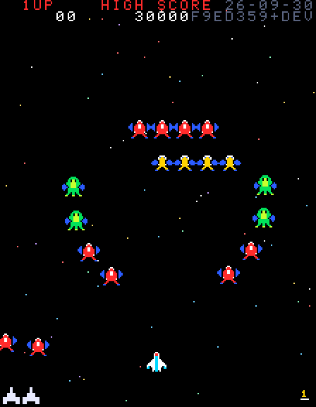
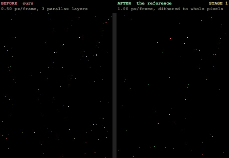
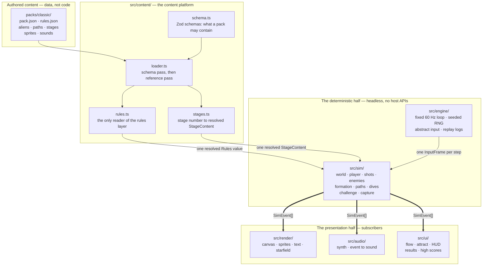
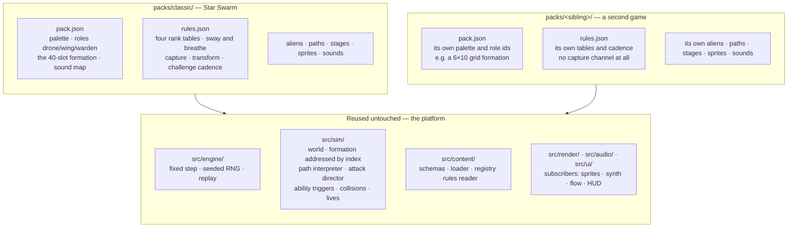
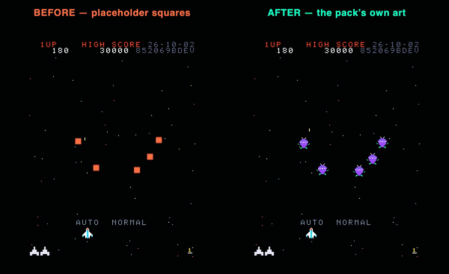
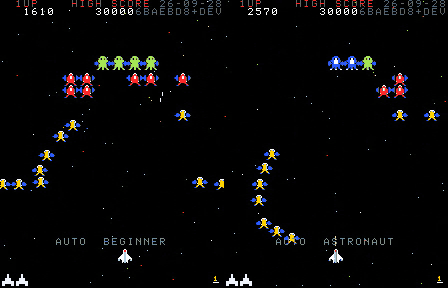

<!-- doc:layer state -->

# Star Swarm — architecture

This document describes the code as it actually stands in this repository. It is
for someone who wants to run the game, see it moving, and understand the shape of
what has been built — not a contributor's guide. Where the design plan
([`docs/DESIGN.md`](DESIGN.md)) and the code disagree, this document follows the
code, and [§5](#5-what-is-not-here-yet) says where they diverge.

> **This is the one document here that makes claims about what exists**, so it is
> the one under test. `tests/unit/docs-accuracy.test.ts` checks every path it
> names, every link and heading it points at, every command it tells you to run,
> the Node range it quotes, every count it states, and — in [§5](#5-what-is-not-here-yet) —
> that everything it calls absent really is. A change that falsifies one of those
> fails its own pull request. `AGENTS.md` has the marker vocabulary; what is not
> checked is prose about _why_, which no test can reach.
>
> Intent lives in [`docs/DESIGN.md`](DESIGN.md), what is next in
> [`docs/ROADMAP.md`](ROADMAP.md), and the unpromised in
> [`docs/IDEAS.md`](IDEAS.md). None of those describes this tree.

---

## 1. What this is

Two things at once, and the second is the reason for most of the structure.

**A 1981-arcade formation shooter.** A 224×288 portrait playfield, a fighter on a
rail along the bottom, forty aliens that fly in as five scripted entry waves,
take formation, breathe in and out, and then peel off in dives to bomb you. It
runs at a fixed 60 Hz, sounds like a cabinet, and is meant to feel right to
someone who played the original.
<!-- check:count classic.formation.slots 40 classic.entryWaves 5 -->

**A content platform that happens to ship that game first.** Almost nothing about
Star Swarm is written into the program. The aliens, their sprites, their sounds,
their flight paths, the formation's geometry, the stage list, the score values,
the difficulty tables, the movement cadence and the playfield itself are JSON
documents under [`packs/classic/`](../packs/classic/). The code that runs them
holds no numbers of its own. A second game in the same arcade lineage is another
directory under `packs/`, not a fork.

**And the build offers more than one game, chosen at start-up.** A **variant** is
one game on the platform, declared as a document under
[`variants/`](../variants/): a display name, the packs it layers, and the
difficulty presets a player may pick from. Star Swarm is `variants/classic.json`
and is the first entry in that list rather than a case the others work around.
Three variants ship: the arcade game, a demonstration overlay, and the forged
Deep Sea game ([§4.6](#46-the-forge)).
<!-- check:count variants.count 3 variants.demonstrations 1 -->

That split is the whole architecture, and it is enforced rather than trusted —
see [§3](#3-the-layers).

The game is playable now, and Milestone 2 is complete: entry waves, formation
motion, slot homing, dive attacks, enemy fire, the difficulty ramp, the transform
attack, scoring, lives, attract mode, game over, the hit-ratio results card and
the high-score table are all in; the normal stages through 8 and eight challenge
stages are authored as pack data; and the capture mechanic — tractor beam,
captured fighter, rogue, rescue and dual fighter — is in. A bomb, a tractor beam
and flying into an enemy all take a fighter, which is every way the arcade has of
doing it. Milestone 3 has begun: the variant concept, the start-up selector and
the player-settings menu are in ([§4.5](#45-variants-the-games-this-build-offers)
and [§6](#6-settings-and-the-difficulty-preset)).
[§5](#5-what-is-not-here-yet) is what is left.
<!-- check:count classic.sequence.normal 6 classic.stages.challenge 8 -->

---

## 2. Running it

You need Node — see the versions below — and nothing else.

```sh
npm install
npm run dev            # http://localhost:5173
```

Then press **Enter** (or **1**) to start a game, **←/→** or **A/D** to move, and
**Space** or **Z** to fire. Fire is an auto-repeat button, as it is on the
cabinet: hold it down, and a shot leaves whenever the two-shot cap frees a slot.
**Esc** (or **M**) opens the settings menu from attract mode. **P** pauses a game
and **X** leaves one, after asking. The game boots into the start-up selector —
more than one game ships — and then into _attract mode_, so nothing responds to the
arrows until you have pressed start.

### Supported Node versions

`package.json` declares `"node": "^22.13.0 || >=24.0.0"`. The floor is set by the
toolchain rather than by the game: Vitest 5 needs 22.12 or newer and ESLint 10
needs 22.13 on the 22 LTS line. CI runs Node 24; this was last verified end to
end on Node 25.9.0, where the whole check suite below passes.

### The commands

| Command                  | What it does                                                 |
| ------------------------ | ------------------------------------------------------------ |
| `npm run dev`            | Vite dev server, with the `/lab` route (see [§4.3](#43-lab)) |
| `npm run build`          | Typecheck, then build to `dist/`                             |
| `npm run preview`        | Serve the built bundle                                       |
| `npm run lint`           | ESLint and Prettier                                          |
| `npm run typecheck`      | `tsc --noEmit`                                               |
| `npm test`               | Vitest: the `unit` and `sim` suites, both headless           |
| `npm run test:e2e`       | Playwright against the dev server                            |
| `npm run validate-packs` | Schema- and reference-check everything under `packs/`        |
| `npm run sprite-sheet`   | Render a pack's art to `docs/media/classic-sprite-sheet.png` |

CI runs lint, typecheck, both test suites, pack validation, the build and the
Playwright smoke test on every push and pull request.

> **Two dev servers at once.** Vite's port is shared between checkouts and
> `playwright.config.ts` reuses an existing server outside CI, so a second
> worktree's Playwright run will silently test the first one's build. Set
> `STAR_SWARM_PORT` to give a checkout its own.

### Which build am I playing?

Every screen carries it, and **no part of it is written down by hand**: the short
commit the build was made from, a `+` if the working tree was modified, `DEV` if a
dev server made it rather than `npm run build`, and the date. `scripts/build-identity.ts`
derives all four from git and the clock, and the plugin in `vite.config.ts` puts
that one serialisation in two places — into the bundle, and into a static
`build.json` beside `index.html`.

It is two dim rows in the **top HUD band**, hard right of the arcade's own score
labels, and one spelled-out line under the attract screen's prompt. Nothing is
drawn over the playfield, and the corner rows fit the gaps the score leaves
exactly (`src/ui/build-stamp.ts` has the arithmetic).


**A running page notices when a newer build is being served.** It fetches
`build.json` every 60 seconds of simulation time, and when what is served is not
what it is running it blinks an amber notice in place of the commit and on the
attract line.
<!-- check:count build.pollSeconds 60 -->


The notice is text and nothing else. It never pauses the game, never takes a key,
and never moves anything already on screen — the rows it blinks in are rows it
already owned. A fetch that fails, or a host with no `build.json` to serve,
changes nothing at all: `src/ui/build-info.ts` swallows it, counts a miss, and a
detection already made is not retracted by going offline. Refreshing **does** lose
the run in progress; the high-score table survives a reload, a game does not,
which is why nothing here ever refreshes for you.

### Refresh, or restart?

Measured against the dev server rather than assumed — a page was open throughout
and each row is what it actually did:

| You changed                    | The dev server                                     | You do                                    |
| ------------------------------ | -------------------------------------------------- | ----------------------------------------- |
| anything under `src/`          | serves the new module and reloads the page for you | nothing                                   |
| a JSON document under `packs/` | the same — a pack edit reloads the page too        | nothing                                   |
| `index.html`                   | the same                                           | nothing                                   |
| `vite.config.ts`               | restarts itself, and the page reloads              | nothing                                   |
| a dependency in `package.json` | ignores it completely                              | `npm install`, then restart `npm run dev` |

So in day-to-day work there is nothing to press: the dev server reloads the page
itself, for game code and for pack data alike. Two things do not follow that rule:

- **The stamp is the moment `npm run dev` started**, not the moment you last
  edited a file, because the identity is derived when Vite reads its config.
  Restarting the dev server re-stamps it; so does touching `vite.config.ts`,
  which restarts the server anyway.
- **A new dependency needs both halves.** A running dev server goes on failing to
  resolve a package after `npm install` has put it in `node_modules`; only a
  restart picks it up.

For a **hosted** build there is no dev server and no reload: publishing is
`npm run build` and then serving `dist/`, which already contains `build.json`
alongside `index.html`. An open tab polls that file every minute of simulation
time and says so when it changes; nothing else has to be pushed to it. Two things
the host has to get right — `build.json` must sit beside `index.html`, because the
page asks for it relative to its own document so that a deployment under a subpath
works, and a host that caches must stop doing so when a new build is published,
because the poll cannot make it.

That host is GitHub Pages, and the publisher is the workflow that already runs
the checks. [`.github/workflows/ci.yml`](../.github/workflows/ci.yml) packages the
`dist/` its own build step produced, and a second job deploys that package — so
**every push to `main` that passes lint, typecheck, both test suites, pack
validation and the smoke test publishes, and a push that fails any of them does
not.** Pull requests never reach the deploy job at all. There is no release build
and nothing to run by hand: what reaches the site is the bundle the suite just
passed against, because it is the same bundle.

Both host requirements above are met, and neither is met by a setting:

- **Beside `index.html`** — `dist/` is published whole, and `build.json` is
  already in it. A project Pages site is served from a repository subpath, which
  is why `vite.config.ts` sets `base: './'`: every asset reference and the
  identity poll alike are relative to the document, so the same bundle works at a
  domain root and under `/star-swarm/` without being rebuilt for either.
- **Fresh because publishing makes it fresh, not because the request asks.**
  `src/ui/build-info.ts` fetches with `cache: 'no-store'` and a `?t=` stamp that
  differs on every poll. On an ordinary static host that is what does it, and it
  is why the dev server and the Playwright run see every change at once. **On
  GitHub Pages neither buys anything**: Pages serves every file through Fastly
  with `cache-control: max-age=600`, will not let you set a header on one file,
  and its edge keys on the path alone, so a request carrying a unique `?t=` comes
  back `x-cache: HIT` with the same `age` as a plain one, and
  `Cache-Control: no-cache`, `no-store` and `Pragma: no-cache` are ignored the
  same way. The 600 seconds is a real lifetime — left alone, `age` climbs to 592
  and resets at the instant `expires` names. **What keeps the poll honest here is
  the deployment: publishing discards the edge copy.** Measured across a real
  deploy, the edge served the old build at `age` 299 — half its lifetime still to
  run — and six seconds later served the new one at `age` 0, `x-cache: MISS`, in
  the same sample that the origin changed. An expiry would have come at 600; this
  was a purge.

So the update path for a hosted build is the merge, and nothing else: a merge to
`main` rebuilds, republishes, and a tab that was already open says **NEW BUILD**
within a minute of simulation time. The minute is the poll's own interval and
nothing else waits behind it — the edge is already serving the new build by the
time the next poll goes out, because the deployment purged it. The ten-minute
lifetime above is what the edge does when nothing is published; it does not stand
between a merge and a player, and it is worth knowing only so that nobody
mistakes it for a bound on the notice. Refreshing is still the player's to press —
it costs the run in progress, which is why nothing refreshes for them.

Where the site is depends on how the repository has Pages configured, so this
document does not write the address down: the deploy job publishes its URL as the
`github-pages` environment's, which is on the workflow run and under the
repository's **Environments**. A hand-copied address here is the same
hand-maintained fact the build stamp exists to avoid.

### What it looks like

Stage 1 from the first frame: five entry waves flying in on scripted paths, the
formation assembling slot by slot, the sway running out until the whole block is
exactly centred, the breathe taking over — and then the fighter opening up on it.


The front end around that is one state machine with ten phases — the start-up
variant selector, attract, the settings menu, playing, paused, the exit
confirmation, the between-stage challenge card, game over, results and high-score
entry. The cabinet boots into the selector when there is more than one game to
choose and into attract when there is not; behind the cards the demo is the _real_
simulation replaying a recorded input log; start begins a game; three fighters
lost ends it into the game-over banner, the hit-ratio results card, and then
either the high-score table or straight back to attract.
<!-- check:count flow.phases 10 -->


`challenge-results` is one of the two phases that return to `playing`: a challenge
stage has ended, the next stage is already on the field, and the world simply stops
being stepped while the card is up. It is a phase rather than a flag precisely so
that "playing" never sometimes means "not stepping the world" — `src/ui/flow.ts`
says so at the top of the file, and the two menu phases are phases for the same
reason: "attract, but not responding to start" is the shape that file exists to
refuse.

### Pause, and the way out

`paused` is the other phase that returns to `playing`, and it is the same
argument a third time: a `paused` boolean beside `phase` would be "playing, but
not stepping the world".

**Pausing is a flow concern and the simulation never hears about it.** Nothing in
`src/sim/` has a notion of being paused; the flow simply stops calling `stepWorld`.
The frame carrying the press is stepped **before** the phase changes, and the
frame carrying the resume is the flow's — the way the start frame in attract is —
so the simulation sees exactly the frames it would have seen had nobody paused. A
resumed run therefore continues **bit for bit**, which `tests/unit/flow.test.ts`
asserts by fingerprinting a paused run against an unpaused run of the very same
frames rather than against a remembered number. A game over raised on the frame
the key was pressed wins: there is nothing left to hold.

**`exit` pauses first and then asks.** Pressing it stops the game on that frame
and raises the confirmation over a world that is no longer moving, so the question
is never answered under fire. Cancelling lands in `paused` — where an ordinary
pause lands — so there is one way to resume and not two. The cursor opens on
`RESUME`, the exit key is also the cancel, and only `fire` commits, so no single
stray press can end a run.


**Confirming discards the run.** The score does not reach the high-score table:
the table records games played out, and a run abandoned halfway is not one. The
other half of that decision is that nothing is discarded _silently_ — the card
names the score, and when the table would have taken it, the place it would have
taken. **Home is attract** in both cabinets: the selector is a boot-time screen
and is never entered at all when one variant is installed, so it cannot be what
leaving a game means; attract is already where a finished game ends up, and the
way back to the list is the settings screen's `GAME` row.

### Losing a fighter

The moment a player sees most often, so it is drawn rather than left to a sprite
that stops being there. Losing the fighter in play raises `player-hit`, the
manifest's `effects` map binds that name to a sprite, and `src/render/effects.ts`
plays it where the event says — the same subscription `src/audio/sfx.ts` already
makes for the `player-death` sound, and the same one-way traffic. Two events are
bound: `player-hit`, and `dual-half-lost` for a rescued second ship being shot
away.
<!-- check:count classic.effects 2 -->

The animation is four frames held twelve simulation steps each — 48 steps, four
fifths of a second — against a respawn the rules put at 90 steps. That gap is the
design and not a leftover: the bang finishes, roughly four tenths of a second of
empty sky follows, and then the fighter comes back. **The explosion is fitted to
the rules, never the other way round**; `tests/unit/effects.test.ts` asserts it
finishes inside the respawn with room to spare, so an animation that outgrew the
window would fail rather than tempt anyone to move a verified-or-provisional
arcade number.
<!-- check:count classic.death.frames 4 classic.death.steps 48 rules.respawnFrames 90 -->

Three decisions worth recording, because none of them is forced:

- **The explosion is bigger than the fighter** — 32×32 over a 16×16 ship, pulled
  back by `-8, -8` so the two share a centre. An explosion the size of the thing
  that died reads as a sprite being swapped; one that overflows it reads as a
  destruction. It is the only sprite in the Classic pack outside the 16×16 cast.
- **Nothing else stops.** Enemies keep flying, the formation keeps breathing and
  the starfield keeps scrolling through a death. That is not a preference so much
  as a consequence: presentation may not reach into the simulation, so anything
  that "held" the world for the animation would be the simulation hearing about
  the renderer — the same shape [pausing](#pause-and-the-way-out) refuses.
- **The reserve indicator drops on the frame of the hit**, not when the animation
  ends. The HUD reads `world.lives.reserve` directly and a lagging copy would be a
  second source of truth about how many fighters are left; the cost reading at the
  same instant as the flash is also what ties the two together.

**The arcade sources do not settle what its own death animation looked like.**
Neither the frame count, nor its timing, nor whether the game holds still around
it appears in [the reference](reference/arcade-reference.md) or in the rules and
scoring investigation behind it — the reference's section 11 lists two open
questions and this is not one of them, because nobody has looked. So the four
frames come from `docs/DESIGN.md` section 5, the timing is ours, and none of it is
marked verified anywhere. It is presentation, so it is not in `rules.json` and
`provenance` cannot reach it; the counters above are what hold this page to it
instead, exactly as they do for [the starfield](#the-backdrop)'s byte arithmetic.



### The backdrop

The starfield behind all of that is the arcade's routine rather than a scroll of
our own. The simulation reports a per-stage **speed byte** — the pack's verified
ROM formula, five values stepping every four stages and plateauing from stage 16 —
and `src/render/starfield.ts` turns it into pixels the way the hardware does: the
byte is added into a six-bit phase accumulator every frame, and the accumulator's
overflow is what scrolls. The rate is therefore `byte / 64`, the field moves
**whole pixels**, and the five bytes give 1.00, 1.25, 1.50, 1.75 and 2.00
px/frame. At 1.25 that is three frames of one pixel and a fourth of two, and the
dithering is the point rather than a rounding detail: a float scroll averaging the
same rate has none of the shimmer. The parallax layers and per-star blink this
replaced were ours — the chip has one scroll register, so every star moves the
same whole pixels on the same frame.
<!-- check:count starfield.speedByteUnit 64 starfield.stageSpeeds 5 -->

Three more behaviours come out of the same ROM routine. The byte **ramps** one
unit per frame toward the stage's target, so stage 4 eases into its rate over
sixteen frames rather than jumping. The field runs **backwards at 3 px/frame while
a tractor beam is out**, which reaches the renderer as `capture-started` and ends
on `capture-failed` or `player-captured` — the backdrop learns it from an event
and never reads the capture channel. And the **twinkle** is not a per-star blink
at all: the generator holds four star banks and draws a pair of them, picked from
two bits of a frame counter the scroll cannot stop, so half the field swaps out
every 8 frames and each star is lit for exactly half of a 32-frame cycle.
<!-- check:count starfield.reversePixels 3 starfield.banks 4 starfield.twinkleFrames 8 -->

All four are verified in `docs/reference/arcade-reference.md` section 2, and they
are the scout report's acceptance tests **M6, M7 and M8** in
`tests/unit/starfield.test.ts`. The reverse is asserted by playing a real capture
and feeding the renderer the events the simulation raised, rather than by setting
the flag and believing it.



### The two mechanics that are easiest to read about and hardest to picture

**Capture.** A captor loops out of the formation, slides down and opens its
tractor beam; the beam takes the fighter and drags it into the captor's own
captive slot; the captured fighter then dives _with_ its captor, is freed when
the captor is shot while both are attacking, and spins in to dock as a second
ship you fly alongside.


That clip is a golden replay played back through the real simulation and the real
renderer, so what it shows is the recorded run rather than a staged one.

An attempt is a **committed swoop**: the captor takes its aim once, at the frame
its `aimAtPlayer` segment begins, and opens its beam where that aim pointed
whatever has happened since. So destroying the fighter in between — a bomb, a
body — leaves a beam open over the column it died in, and the channel stays busy,
because the arcade's capture flag is not cleared by the player dying. The
replacement fighter therefore waits: `resolveRespawn` serves the respawn timer as
usual but holds the fighter off the field until the beam has retracted
(`beamIsOut` in `src/sim/capture.ts`). Without that hold it arrives at its one
fixed column underneath a beam already at full extension and is taken on the
frame it appears. The hold is bounded — a beam that catches nothing always
retracts and releases — and the beam stays on screen throughout, so the pause
reads as the beam passing rather than as a stall.

**A challenge stage and its card.** Forty enemies in five groups of eight fly
scripted convoys and leave without ever attacking; the stage then ends on the
between-stage card, with the hit count and the end-of-stage award.


> The score this clip happens to land on is one the arcade record does not yet
> settle. `docs/reference/arcade-reference.md` section 11's open item is whether a
> challenge stage's second wave keeps four boss-class objects; the two readings
> differ by 1,200 points on a perfect first challenge stage, and the pack is built
> to one of them. `packs/classic/stages/README.md` carries both. Read the clip as
> the mechanic, not as the number.

---

## 3. The layers

Six directories under `src/`, in two groups: the half that computes what happens,
and the half that shows it. The arrows below all point one way, and that is the
single most important fact about this codebase.
<!-- check:count src.layers 6 -->



`src/main.ts` is the only place those four meet and is deliberately not on the
picture: it loads the pack, owns the display, the keyboard and the audio context,
calls `flow.step(frame)` once per simulation step, hands the events that come
back to the subscribers, and draws whatever phase the flow says it is in. It
holds no game logic of its own.

Read the picture as three claims.

**`src/sim/` imports nothing from `src/render/`, `src/audio/` or `src/ui/`, and
touches no host API.** No DOM, no Canvas, no Web Audio, no `Date`, no
`performance`, no `Math.random`. It is handed an input frame and a step, and it
hands back a list of events describing what happened. The presentation layers
read those; nothing calls back in.

**That rule is mechanical.** `eslint.config.js` restricts the imports and the
host globals inside `src/sim/`, and bans `Math.random` across `src/sim/` and
`src/engine/`. `tests/unit/sim-boundary.test.ts` scans the tree as a backstop
_and_ runs ESLint against a deliberately illegal probe file, so the rules cannot
be quietly deleted. Both run in CI. (The tree scan is textual, which is why an
identifier spelled exactly `window` fails inside `src/sim/` even as a local
variable — name it `hitWindow`.)

**That is what buys the testing story.** Because the simulation needs no browser,
both Vitest projects run on the **Node** environment with no DOM at all:
`tests/sim/` runs whole games headlessly, and the golden replays in
`tests/sim/golden/` re-run a recorded seed and input log and fail if the run no
longer ends in the same state. Attract mode is the same mechanism pointed at the
screen — it is the real game replaying a real input log, so the demo cannot drift
from the game.
<!-- check:count vitest.projects 2 -->

One honest limit on that, worth stating because it is easy to overclaim:
**determinism holds for a given machine, not across machines.** `Math.sin`,
`Math.cos` and `Math.atan2` are engine-defined and can land one unit in the last
place apart on different CPU architectures — a golden recorded on an arm64 Mac
really did fail CI on x86-64 Linux over a single bit in one enemy's position. So
the state a golden compares is quantised to six decimal places: far coarser than
that noise, and still half a million times finer than the half-pixel that is the
finest difference anyone could see. That makes the goldens portable; it does not
make the simulation bit-identical, and nothing here claims it does.

### The layers one at a time

| Layer          | What it is                                                                                                                                                        |
| -------------- | ----------------------------------------------------------------------------------------------------------------------------------------------------------------- |
| `src/engine/`  | The fixed-step loop, the seeded RNG, abstract input, and input recording/replay. Knows nothing about this game or any game.                                       |
| `src/sim/`     | The world and one step of it: player, shots, collisions, lives, enemies, formation, the path interpreter, dives, enemy fire, challenge stages and capture.        |
| `src/content/` | The content platform: the Zod schemas, the loader, the registry, the module that interprets a rules document, and stage resolution.                               |
| `src/render/`  | The 224×288 backbuffer presented at a whole-number scale, sprite rasterisation, the pixel font, the starfield, one-shot effect animations, and scene composition. |
| `src/audio/`   | A parametric synth over Web Audio, and the mapping from simulation events to sounds.                                                                              |
| `src/ui/`      | The game-flow state machine, attract mode, the HUD, the results card, the high-score table — and the dev-only `/lab`.                                             |

Four properties worth knowing, because each one is load-bearing:

- **Time is steps, never milliseconds.** `src/engine/loop.ts` accumulates in
  whole steps and carries a tolerance, because 1/60 is not representable in
  binary floating point and naive millisecond subtraction loses a step per burst.
  Every timer in `src/ui/flow.ts` counts simulation steps too, so a screen looks
  the same at the same step on any machine.
- **The simulation has no constants.** `createWorld` _requires_ a resolved
  `Rules` value. The movement cadence, travel limits, shot cap, hit windows,
  extra-life thresholds, the formation's sway and breathe, the enemy update
  cadence, the starfield speed formula and the playfield dimensions all arrive
  from the pack. A number the sim needs that is not in the schema is a number no
  pack can change — which is the failure this arrangement exists to prevent.
- **The renderer holds no art and no colours.** Everything derived from pack data
  is rasterised once when the pack loads, not per frame, and a sprite colour the
  pack's palette does not declare is a load-time error rather than a silent black
  pixel.
- **Audio is optional by construction.** No `AudioContext` exists until a user
  gesture unlocks one, and every call into Web Audio is wrapped, so a browser
  that blocks audio leaves the game running correctly in silence. Which event
  plays which sound is the pack's `sounds` map; `src/audio/sfx.ts` names no
  effect of its own. **The picture works the same way**: the manifest's `effects`
  map says which event plays which sprite animation, and `src/render/effects.ts`
  names no explosion of its own either.

---

## 4. Where a new pack, and a new game, plug in

### 4.1 The content pipeline

A pack is authored — by hand, or by the `/forge` skill ([§4.6](#46-the-forge)) — as
plain JSON under `packs/<name>/`. Nothing else reads those files: everything goes
through one `loadPack`, and the same function serves the browser, the tests and
the validation gate, so the game and the gate cannot disagree about what a pack
contains.


Three things the picture is making explicit:

- **A pack that fails either pass never loads.** `loadPack` returns errors or a
  pack, never both, and there is no partially-loaded intermediate for a caller to
  reach for. `npm run validate-packs` calls that same function rather than
  reimplementing the checks, which is why the gate cannot pass something the game
  then refuses to boot on.
- **Two readers, deliberately.** `fs.ts` walks the directory with `node:fs` for
  the validator and the tests; `bundle.ts` walks the same tree with Vite's
  `import.meta.glob` for the browser. Neither is re-exported from the platform's
  `index.ts` — one would pull `node:fs` into the browser bundle, the other a
  Vite-only transform into plain Node — and `tests/unit/bundled-packs.test.ts`
  holds the two to each other.
- **The simulation never sees any of this.** It is handed a resolved `Rules`
  value and a `StageSource` that answers "what plays as stage _n_". It has no
  idea a pack, a registry or a file exists.

### 4.2 How far each number may be trusted

Arcade-derived packs mix numbers taken from a ROM disassembly with numbers
somebody chose, and the two are not equally free to change. So the marking is
data: `provenance` in `rules.json` maps a field path to **verified**
([`docs/reference/arcade-reference.md`](reference/arcade-reference.md) carries
the routine behind it) or **provisional** (it is ours), with a note. The loader
rejects a provenance key that names no field, so a rename cannot leave a stale
marking behind. It is granular where the confidence is: a shot window's Δx bounds
are verified and its Δy bounds are not.

### 4.3 `/lab`

`/lab` is where a human checks one piece of content in isolation before it goes
anywhere near a stage. Today it previews movement paths: every path in the loaded
packs, one drawn at a time, with a scrubber, a live readout of position, heading
and speed at the current frame, a mirror toggle, and click-to-place markers for
the formation slot and the player. Aliens, sprites, sounds and stages join it in
Milestone 4.


Two details the clip shows that matter more than they look:

- **Mirroring is a reflection applied to the evaluation, not a second copy of the
  data.** World-space targets reflect in, sampled positions reflect out, and arcs
  reverse their handedness because the reflection says so. A pack that ships a
  hand-mirrored twin of a path is working against the interpreter. The game uses
  the same mechanism to fan a dive outwards, picking the flag from which side of
  the formation the enemy sits on.
- **A dive path states no start position.** It is flown from wherever the enemy
  already sits, so every segment is relative to the flyer's pose. `/lab` starts
  such a path at its slot marker, which is why a dive previews there at all.

`/lab` is dev-only, three ways at once: Vite's only build input is `index.html`,
nothing on that graph imports the lab, and the URL is wired up by a plugin
declaring `apply: 'serve'`. `tests/unit/lab-dev-only.test.ts` checks all three.

### 4.4 Where a second game plugs in

The standing direction is that Star Swarm is the first game on a shared arcade
platform, with a Galaxian-lineage mode and further variants to follow. A sibling
game is **another pack and another `rules.json`**. Nothing under `src/` is
expected to change.



The clearest single example of that boundary is the tractor beam, because it is
already built both sides of the line. `packs/classic/paths/dive-capture.json` is
four segments of authored data, and the third of them is:

```json
{ "type": "trigger", "ability": "captureBeam" }
```

The path says _when_ — a `trigger` segment on the flight's timeline, after the
loop and the run at the player. `src/sim/capture.ts` is _what_, and it opens the
beam when a flight passes that segment naming that ability. Neither knows the
other: the path names an id from the fixed registry in `src/content/schema.ts`,
and the channel matches on the id. So moving the beam later in the dive is a
one-line edit to a pack document, and a sibling game that wants a beam of its own
authors the same `trigger` in its own path — while a sibling that wants none
simply never writes one, which is why "no capture channel at all" is a property
of a pack rather than a branch in the engine.

The split follows the classification in the rules-and-scoring scout report
(section 9), not a fresh decision:

**Platform — the shape any game in this lineage needs.** The score pipeline: a
base value, a multiplier that depends on the target's motion _state_, and a
separate bonus channel. The rules skeleton: reserve lives, threshold-based extra
lives with a repeat interval and a ceiling, a cap on player shots and a cap on
enemy bullets, rank as a selector over whole data tables rather than a
multiplier, and a stage-number → table lookup whose plateau rule is per-table
data. The formation geometry: _N_ column coordinates plus _M_ row coordinates,
with enemies addressing them by **index** — which is why sway and breathe move
sixteen numbers instead of forty, and why a differently shaped grid inherits both
motions with no new code. The starfield's speed byte.

**Star Swarm's own, and therefore in the pack.** The specific values and the
specific state machines: the 50/80/150 score bases, the escort-bonus latch, the
capture channel and everything hanging off it (a sibling need not have any of
it), the transform attack, the challenge cadence, the sway and breathe
amplitudes, and the entry scripts.

**The two seams that would fork the engine if hard-coded.** The report names
both, and the code keeps both on the data side:

1. **The score-group table.** The doubling _rule_ is the platform's —
   `rules.scoring.movingMultiplier`, applied by the simulation on the target's
   motion state, so an alien shot while diving or entering is worth double the
   one sitting in formation. The _values_ are the pack's: each alien declares its
   own base score, and "this one takes a second hit" is that alien's own `hp` and
   `hitSprites`, not a role the engine knows about. A sibling with different
   groups and a different two-hit rule changes only its own documents.
2. **Stage-index arithmetic.** This game alone uses several different functions
   from stage number to table row, so the platform provides "look up row
   _f_(stage) in table _T_" with _f_ declared per table: every ramp is literal
   rows plus its **own** plateau period (`plateauTableSchema` and `resolveRow` in
   `src/content/schema.ts`), and the normal and challenge stage sequences
   deliberately plateau on different periods. Nothing interpolates between rows,
   and there is no difficulty multiplier anywhere — three of the four rank tables
   contain a stage markedly easier than the one before, and a curve cannot
   reproduce that.

Concretely, a sibling supplies a manifest (its palette, its role ids, its
formation), a `rules.json`, and its own aliens, paths, stages, sprites and
sounds. It reuses the loader, the registry, the path interpreter, the formation
machinery, the attack director, the renderer, the synth, the front-end flow and
the whole test harness.

### 4.5 Variants: the games this build offers

A **variant** is one game on the platform. `packs/` says what content exists;
`variants/` says which _game_ a player can start, and the two are different
questions — the registry layers packs within one game, which is not the same as
offering several. A variant document is a display name, the packs it layers, and
the difficulty presets it offers:

```json
{
  "id": "swarm-remix",
  "name": "SWARM REMIX",
  "packs": ["classic", "swarm-remix"],
  "demonstration": true
}
```

`src/content/variants.ts` holds the schema and the two-pass load, beside the pack
schemas it belongs with. Adding a game is adding a document: nothing under `src/`
names a variant, a pack or a rank.

**A variant is validated exactly as a pack is.** The schema first — strict
objects, so a misspelt field is a failure rather than a field that silently does
nothing — then the references: every pack it names must be installed, the packs it
layers must supply a `rules.json` between them, and every difficulty preset must
name a rank those rules declare. A failure carries the document and the field
(`variants/swarm-remix.json` · `difficulty.presets[0].rank`), errors or variants
come back but never both, and `npm run validate-packs` runs the same
`loadVariants` the browser does.

**Both directories are read the same two ways.** `content/fs.ts` walks them with
`node:fs` for the validator and the tests, `content/bundle.ts` globs them for the
browser, and `tests/unit/bundled-packs.test.ts` holds the two readers to each
other for variants as well as packs — a variant on disk but not in the bundle is a
game the gate passes and the browser cannot offer.

**"Later wins" reaches the manifest and the rules, which is what makes an overlay
pack possible.** `src/content/registry.ts` composes the layered packs' manifests
field by field rather than taking the last one whole: `roles`, `formations` and
`sounds` merge per key, the palette is a **union** (it is a permission list that
`src/render/sprites.ts` checks membership in and never indexes), and
`stageBadges` and each half of `stageSequence` are replaced by the last pack that
states a non-empty one. Rules are the whole document from the last pack that ships
one. A single-pack registry gets its own manifest back unchanged, so this is a
generalisation of the rule the registry always documented rather than a second
rule beside it — and it is what lets `packs/swarm-remix/`'s `pack.json` be four
lines.

`packs/swarm-remix/` is the demonstration, and it exists to prove the claim rather
than to be a game: it states three documents — a different drone dive, a different
fire sound and a differently coloured player shot — and inherits the roles, the
forty-slot formation, the stage sequence, the badges, the palette and all 2,200
lines of `rules.json` from the pack it is layered over.
`tests/unit/variants.test.ts` asserts that: the demonstration runs the _same_
`Rules` object as Classic, and the documents that differ between the two variants
are exactly the ones the overlay directory holds.

**One limit worth stating, because it bounds what an overlay can be.** `loadPack`
validates a pack's references _within that pack_, which is what makes
`npm run validate-packs` meaningful per pack and what lets a pack be loaded on its
own. So an overlay can **replace** a self-contained document — a sprite, a sound,
a path that names no sound — but cannot add one that _references_ the base pack's
content: a stage naming Classic's aliens, or a stage sequence naming Classic's
stages, fails its own load. Richer overlays would need the reference pass to run
over the composed variant, and nothing does that today.

**A variant does not override rules.** There is no mechanism in the schema for
patching a rules field, deliberately: a variant that could nudge individual
numbers would be a difficulty multiplier with a different name, and
[`docs/DESIGN.md`](DESIGN.md#6-configuration-system) section 6 is explicit that
rank selects whole data tables instead. A variant that wants different numbers
ships a pack with a `rules.json` that has them — which is also exactly what
[§4.4](#44-where-a-second-game-plugs-in) says a sibling game does.

### 4.6 The forge

`docs/DESIGN.md` pillar 3 is that a single sentence becomes a validated content
pack you can play in minutes. Three things make that true today, and one of them is
a refusal:

| What                             | Where                                                                 |
| -------------------------------- | --------------------------------------------------------------------- |
| the procedure                    | `.claude/skills/forge/SKILL.md`                                       |
| what a pack may say, and may not | [`docs/content-guide.md`](content-guide.md)                           |
| the pack it produced             | [`packs/deep-sea/`](../packs/deep-sea/) plus `variants/deep-sea.json` |

The split is the usual one here: the skill is a procedure and names no field, the
guide is a state document whose claims are checked, and neither copies
`src/content/schema.ts`. A schema pasted into a skill is the failure this project
has already fixed in a README, a plan, this document and a pack README.

**`packs/deep-sea/` is the end-to-end proof, and it was proved by playing.** Three
aliens, four flight paths, three stages, four sprites, two sounds and a
twenty-six-slot formation of its own, layered over Classic for the rules, the
roles, the badges and the challenge half of the stage sequence. Its own README
carries the sentence it came from, the measurements, and the two things the forge
got wrong before it got them right.
<!-- check:count deepSea.aliens 3 deepSea.paths 4 deepSea.stages 3 deepSea.sprites 4 deepSea.sounds 2 deepSea.formationSlots 26 -->


**Two gaps shape what a forge can promise**, and both are measured rather than
described:

- **No ability can be composed.** `src/content/schema.ts` reserves seven ability
  ids and `src/sim/abilities/` holds no modules, so an alien cannot _do_ anything
  beyond moving, firing its configured pattern, taking hits and being worth points
  ([§5](#5-what-is-not-here-yet)).
  <!-- check:count schema.abilityIds 7 sim.abilities.modules 0 -->
- **Passing the validator does not mean the stage is playable.**
  `npm run validate-packs` runs schemas and references and never starts the
  simulation; the four playability checks `docs/DESIGN.md` section 8 step 2 asks for
  are not written. So the forge's last step is to fly the content with an autoplay
  persona and report the outcomes, which is what `tests/sim/forged-pack.test.ts`
  does: every enemy reaching its slot, every dive staying on screen from every slot
  its alien can occupy, the stage being clearable, no run stalling, and one seed
  giving one world.

**Refusing is a feature of the skill, not a failure of it** — `docs/DESIGN.md`
section 7.5 asks for it — and the reason it has to happen at generation time is
machine-checked. `tests/unit/forge-guard.test.ts` asserts that a world plays
_identically_ whether or not an alien declares an ability, whether or not a stage
states `modifiers` or `diveRules`, and that an alien in a role no difficulty row
names never launches. Each of those validates, passes the gate, and does nothing —
so a pack that improvised around a missing capability would be indistinguishable
from one that worked until somebody played it. The same file holds every pack and
every variant to `docs/DESIGN.md` section 2: a scan for the original's name and for
the arcade's own enemy-type words as ids, which is what makes "original by rule"
something a prompt cannot argue with.

---

## 5. What is not here yet

Milestone 2 is complete, so nothing below is missing from the game you can play
today — it is the content the pack does not yet author, and the modules the plan
calls for that nobody has written. **Every absence here is checked**: the marker
at the end of each item fails the build on the day the file lands, because a
stale absence list is the failure mode this section is most prone to — a document
describing as deliberately absent something that shipped two merges ago.
[`docs/ROADMAP.md`](ROADMAP.md) is where each of these is scheduled.

- **Normal stages past 8.** The pack authors the normal stages through 8 and then
  plateaus on the last of them, because the arcade's seventeen-entry index list
  cycles its final three rows and claiming that plateau three rows early would
  assert something that is not there. The challenge half does _not_ plateau — all
  eight of its scripts cycle — so the two halves of one sequence deliberately
  repeat on different periods. Difficulty keeps ramping past 8 either way: the
  rank table is a separate ramp with its own 26 rows across all four ranks.
  <!-- check:count classic.sequence.normal 6 classic.sequence.challenge 8 rules.ranks 4 rules.difficultyRows 26 -->
- **The other three difficulty ranks' stage sequences.** The pack ships one
  pack-wide sequence. Reference section 5 gives all four ranks' index lists, and
  they need ten of the thirteen combat scripts through stage 8 alone;
  `packs/classic/stages/README.md` records why they cannot land until the
  remaining scripts do.
- **The ability registry.** `src/sim/abilities/` is a placeholder README and holds
  no code. The one ability the game needs is implemented directly in
  `src/sim/capture.ts`, which matches on the `captureBeam` id a path's `trigger`
  segment names ([§4.4](#44-where-a-second-game-plugs-in)); splitting the registry
  out, and the six other ids `src/content/schema.ts` already reserves, is
  Milestone 3. The consequence for generated content is that an alien cannot _do_
  anything: `abilities` validates with any reserved id and is read by nothing, so
  `/forge` **refuses** a prompt that needs one rather than producing something
  adjacent ([§4.6](#46-the-forge)).
  <!-- check:count sim.abilities.modules 0 schema.abilityIds 7 -->
- **The optional CRT filter, music** and the validator's playability checks are
  named in the design plan and are not written yet. The CRT **option** is in: the
  settings menu shows it, it persists, and the menu row says on screen that no
  filter reads it. <!-- check:absent src/render/crt.ts src/audio/music.ts -->
- **No stage is a boss stage.** `boss` is one of the three stage kinds the schema
  admits, and no pack document uses it — what a boss stage would be has never
  been specified ([`docs/IDEAS.md`](IDEAS.md)).
  <!-- check:count classic.stages.boss 0 schema.stageKinds 3 -->
- **A captor never launches with escorts, so 800 and 1,600 are unreachable.** The
  escort bonus itself is paid: a captor carries the latched value its stage start
  installs and `enemyScore` in `src/sim/enemies.ts` adds it on the doubled branch,
  so a captor destroyed mid-dive is worth 400 and one shot at home is worth 150.
  What is missing is the _launch_: `src/sim/dive.ts` sends one enemy of a role down
  per round robin and has no notion of a boss leading a wingman, so the pack's
  `scoring.escortBonus.byEscortCount` entries for one and two escorts are data
  nothing can select. The scout report's acceptance tests **S7 and S9** are
  therefore not satisfiable today, and the latch that makes them interesting —
  killing the escorts first must not reduce the captor's value — cannot be
  observed either.
- **There is no pulsing-formation sound.** `formation-settled` is raised on the
  frame the sway passes back through zero and the breathe begins there, which is
  asserted in `tests/unit/formation.test.ts`; the arcade starts its pulsing
  formation tune on that same frame, and `packs/classic/pack.json` binds no sound
  to the event. The second half of acceptance test **M2** is therefore about
  something the pack does not ship yet.
- **The pack manager and the stage-sequence editor.** The settings menu shows the
  active variant's pack list as a read-only row, and the settings document already
  carries a per-variant override the loader honours — nothing writes one yet, which
  is the whole of what is missing.
- **An overlay pack cannot reference the base pack's documents**
  ([§4.5](#45-variants-the-games-this-build-offers)). It can replace a
  self-contained document and nothing more, because the loader's reference pass
  runs within one pack.
- **A variant cannot reference another variant's autoplay personas.** Each document
  declares its own, and the forged game's `astronaut` is therefore the same eight
  numbers as the Classic game's rather than a reference to them — the one piece of
  duplication the variant schema has no way to avoid. It is small and visible, and
  a shared-persona mechanism has never been specified.

Two arcade questions are also still open rather than decided, and the game is
built to one reading of each. Both are written down in
`docs/reference/arcade-reference.md` section 11, and both are recorded here
rather than resolved because nothing in `src/` turns on the answer, as they are
in [`docs/ROADMAP.md`](ROADMAP.md#open-questions-this-roadmap-does-not-answer):

- **Whether a challenge stage's second wave keeps four boss-class objects.** It
  changes what a perfect challenge stage pays; the alternative readings are also
  in `packs/classic/stages/README.md`, and switching is one line per challenge
  document.
- **What a collision with an enemy body does beyond killing the fighter** —
  whether it destroys the enemy as well, and whether it scores. Every kill and
  every point the reference traces arrives through the original's _rocket_ hit
  dispatcher and none through the fighter-hit path, so the engine takes the
  negative reading of both: a ram costs a fighter and changes nothing else.
  Switching would be `resolveBodyCollisions` in `src/sim/world.ts` and the
  goldens it moves.

<!-- check:count reference.openQuestions 2 -->

### Three places where the tree departs from the plan

[`docs/DESIGN.md`](DESIGN.md#9-architecture-split-so-crewmates-dont-collide)
section 9 fixes the six directories under `src/` and what belongs in each; it
names no modules, deliberately, and this document is the listing. Three of its
divisions of labour did not survive contact with the code, and the code is what
this document follows:

- **There is no scoring module and no stage module in the simulation.** Scoring
  lives in `src/sim/enemies.ts` and `src/sim/world.ts`, because a score is a
  property of the thing destroyed and the run it happened in rather than a stage
  in a pipeline. Stage resolution is `src/content/stages.ts`, on the content side
  of the boundary, because turning a stage number into documents is content work:
  the simulation is handed a resolved `StageContent` and never learns a pack
  exists.
  <!-- check:absent src/sim/scoring.ts src/sim/stages.ts -->
- **`src/content/` grew past the three modules the plan sketched.** Alongside
  `schema.ts`, `loader.ts` and `registry.ts` there are `rules.ts`, `stages.ts`,
  `variants.ts`, `errors.ts`, and the two pack readers `fs.ts` and `bundle.ts` —
  one for Node, one for the browser, held to each other by a test
  ([§4.1](#41-the-content-pipeline)).
- **There is a seventh top-level directory, `variants/`.** Section 9 lists what
  sits outside `src/` — `packs/`, `tests/`, `docs/` — and a variant does not fit
  any of them: it _composes_ packs, so it cannot live inside one, and
  `npm run validate-packs` treats every directory under `packs/` as a pack. It is
  a sibling of `packs/` for that reason
  ([§4.5](#45-variants-the-games-this-build-offers)).

None of the three is a change of plan; the plan remains the source of truth for
scope and milestones.

---

## 6. Settings, and the difficulty preset

[`docs/DESIGN.md`](DESIGN.md#6-configuration-system) section 6 has three
configuration layers: engine rules, content packs, and the player's settings. The
third is in, as `src/ui/settings.ts` and the menu in `src/ui/menus.ts`, and the
whole of what is interesting about it is the boundary with the first.

**Nothing in the settings is a number the simulation steps.** The eight values are
the chosen variant, the difficulty **preset id**, the autoplay **persona id**,
volume, mute, the CRT option, the control scheme, and a per-variant pack-list
override. Where each one arrives:

| Setting      | Applied by                                                                  |
| ------------ | --------------------------------------------------------------------------- |
| `variant`    | which game `src/ui/flow.ts` builds every world from                         |
| `difficulty` | a preset id → a rank → the rules layer's own tables                         |
| `autoplay`   | a persona id → the pilot the flow hands the controls to ([§7](#7-autoplay)) |
| `volume`     | `Synth.setVolume`                                                           |
| `muted`      | `Synth.setMuted`                                                            |
| `controls`   | the keyboard map handed to `createKeyboardInput`, one of three schemes      |
| `crt`        | stored and reported; no filter reads it yet                                 |
| `packs`      | an override of a variant's pack list, honoured on load, written by nothing  |

<!-- check:count ui.controlSchemes 3 -->

The menu shows at most one row per setting, and two of them are shown only when
there is something to choose: `GAME` needs more than one variant, and `AUTOPLAY`
needs a variant that declares personas.
<!-- check:count ui.settingsRows 8 -->

**The difficulty preset does exactly one thing: it chooses the rank.** It is not a
multiplier and there is nowhere in the shape to make it one. A preset is an id, a
label and a rank id; `rankFor` in `src/content/variants.ts` turns the setting into
a rank, and `src/content/rules.ts` resolves that rank into whole data tables. The
rank reaches **both** halves of what section 6 says a rank selects — the per-stage
difficulty rows and the entry-wave script sequence — because the flow passes it to
`createWorld` _and_ to `createStageSource`; a preset that reached only the world
would apply half of it. `tests/unit/variants.test.ts` asserts the resolved row is
_identical_ to the rank's own row rather than merely different between presets,
which is the assertion a multiplier would also pass.

A preset the active variant does not offer resolves to that variant's default
rather than throwing. A settings document outlives the build it was written
against, so an id from another game — or a variant that is no longer installed —
has to read as "use the default".

**Settings persist the way high scores do, and degrade the same way.**
`src/ui/storage.ts` holds the one `KeyedStorage` both use: two methods over a
string, neither of which may throw. `localStorage` is not available in every
browser state — a private window, blocked site data, a cookie policy that makes
the property access itself throw — so the browser implementation catches on every
path, including the construction-time probe, and falls back to an in-memory store
that behaves identically for one session and reports `persistent: false`. The
settings screen says so when it is session-only.

**The menu applies nothing.** A row that changes calls `write` with a patch and
stops; what a changed setting _does_ belongs to whoever owns the synth, the
keyboard and the sprite sheet, which is `src/main.ts`. So there is one place a
setting has consequences, and the menu is testable on the Node environment with no
DOM like everything else in `src/ui/`.

**And `src/main.ts` asks which game is in force rather than assuming.** The flow
starts on the _remembered_ variant, which is not the first one in the list, and
`onVariantChange` reports a **change** — which starting on one is not. So the
presentation is built by calling `applyVariant(flow.variant)` once at boot and
again from that callback, and `applyVariant` is the only thing that may build one:
a second builder is a second answer to which game this is. Two answers is exactly
what shipped — a refresh onto Deep Sea ran a Deep Sea world under Classic's sheet,
and every enemy drew as a flat placeholder square.

That failure was invisible to a suite that asks the page what it thinks, because
the page thought correctly about all of it. Two things close it. `src/render/scene.ts`
no longer treats "no sheet" and "a sheet without this sprite" as one case: the
first is the documented art-free fallback, the second can only be a sheet and a
world from different variants and throws `SceneSheetMismatchError`. And
`tests/e2e/variants.spec.ts` reads the **canvas** after a reload onto a remembered
variant and requires none of `scene.ts`'s three placeholder colours on it — a
pixel assertion rather than a state one, which is what this suite was missing.
`tests/unit/scene.test.ts` holds both halves, including that no shipped pack
palette declares a placeholder colour, so the pixel test cannot quietly stop
meaning anything.




---

## 7. Autoplay

The cabinet can play itself, as one of several named **personas**, so that the game
can be watched rather than played. `beginner`, `normal`, `expert` and `astronaut`
ship with the Classic game, and the forged Deep Sea game declares two of its own —
six across the build, because a persona belongs to the variant it plays and there
is no way for one document to reference another's.
<!-- check:count autoplay.classicPersonas 4 autoplay.forgedPersonas 2 autoplay.personas 6 -->

**Attract mode is the wrong shape for this, and that is why autoplay is not built
on it.** The demo in `src/ui/attract.ts` is the real simulation driven by a
**recorded input log** — a recording, which cannot adapt to a game that fights
back differently, so four personas would be four recordings of four different runs
rather than four ways of playing one. The scripted pilots in
`scripts/record-replay.ts` are the right shape: something that reads the world and
decides. `src/ui/autoplay.ts` is that, made into data.

### A persona plays; it does not cheat

The pilot is handed a `PilotView` — **a freshly built plain value holding what is
on the screen** — and never a `World`. It cannot read the difficulty row, a bomb
timer, a launch frame or the generator, and it cannot write anything at all,
because `viewOfWorld` copies numbers out and leaves no reference to reach back
through. What it returns is one `InputFrame` carrying the same three bits a
keyboard carries: left, right and fire.

That is asserted rather than described. `tests/unit/autoplay.test.ts` fingerprints
a world, samples the pilot against it 1,200 times, and requires the fingerprint to
be unchanged; it holds the view's field list to what a player can see, checks the
sightings are the ones `src/render/scene.ts` draws, and checks that no frame ever
carries `start`, `menu`, `pause`, `exit`, or left and right at once.

The view does carry three numbers that come from the rules — the fighter's
vulnerable depth and width, and its rocket speed. They are there because they are
properties of the player's own ship, learned in one life and visible in every shot
ever fired, and because without the rocket speed the pilot cannot **lead** a
moving target: a rocket takes about thirty steps to reach the formation, so firing
at where something _is_ misses everything that moves.

### Eight axes, and each one is a document's

A persona is eight numbers and a flag, all in `variants/<id>.json`, all in the
game's own units — pixels of the playfield and **simulation steps**, never seconds
and never a normalised "skill".
<!-- check:count autoplay.axes 8 -->

| Axis             | What it bounds                                                      |
| ---------------- | ------------------------------------------------------------------- |
| `reactionSteps`  | how stale the view it decides from is                               |
| `aimTolerance`   | how far off the intercept it will still pull the trigger            |
| `threatHorizon`  | how far up the screen it notices something coming                   |
| `dodgeMargin`    | the clearance it keeps, on top of the fighter's own vulnerable band |
| `shotDiscipline` | how reliably it keeps one of its two rockets back                   |
| `panic`          | how often a pressing threat provokes a wasted reversal              |
| `engage`         | how often it goes under a diver to shoot it rather than stay put    |
| `rescue`         | whether it takes the risk of going for the dual fighter             |

`src/content/personas.ts` holds the schema and is the only place a persona is
interpreted. There is no `if persona ===` anywhere: every field is read by name and
applied identically, so a fifth persona is a fifth entry in a document and nothing
else. A persona is validated the way a pack and a variant are — the schema first,
strictly, then the references — and a failure names the document and the field
(`variants/classic.json` · `autoplay.personas[1].id`).

**The names are a claim about outcomes, and it is tested.**
`tests/sim/autoplay-personas.test.ts` plays every persona over 32 seeds and
requires the mean score, the median score and the average survival to increase at
every step up the ladder, and the whole ladder to span at least half again from end
to end. One seed says nothing — a bad dive ends an astronaut's run and a lucky one
carries a beginner's — so the claim is only ever made over a block of them.

### The way in

The `AUTOPLAY` row on the settings screen, which lists OFF and then each persona
the active variant declares. Choosing one and leaving the menu is the whole of
starting: attract has no timer to move it on, so the flow pushes `start` there
itself and the persona flies the game that begins.

**A human taking the controls always wins, immediately.** `left`, `right` or `fire`
pressed while a game is live — or `start` pressed at the attract screen — clears the
setting on that frame, so the fighter is the person's from that step and nothing
takes it back without being asked again. The rule is deliberately no wider than
that: every other phase belongs to a _cursor_, and reading a press there as a
takeover meant that choosing a persona with `fire`, answering the exit card, or
skipping a seven-second results screen all silently ended the watch session.

`menu`, `pause` and `exit` are never takeovers. **A watched run pauses like any
other** — which is exactly what a watcher wants when a persona gets itself into
something worth looking at — and `exit` discards the run without disarming
autoplay, so the cabinet goes back to watching the next one.

One consequence worth stating because it is a real edge: with autoplay armed, the
attract screen lasts a single step, so the settings screen cannot be reached from
it. Changing persona means taking the controls first, which is one keypress and is
the same gesture as stopping.



### Determinism survives

Same seed, same persona, same run. The pilot's only clock is the step count on the
view it is handed, and its only source of chance is a seeded `Rng` of **its own** —
never the world's, so how much a persona dithers cannot change what the simulation
computes. `eslint.config.js` puts `src/ui/autoplay.ts` under the same `Math.random`
ban `src/sim/` and `src/engine/` are under and bans `Date` and `performance` in it
besides, and `tests/unit/autoplay.test.ts` replays a recorded list of views through
two pilots on one seed and requires every frame to agree.

---

## Where to read next

| You want                             | Read                                                                  |
| ------------------------------------ | --------------------------------------------------------------------- |
| Why the project exists, and the spec | [`docs/DESIGN.md`](DESIGN.md) — intent, never state                   |
| What is next, and in what order      | [`docs/ROADMAP.md`](ROADMAP.md)                                       |
| Directions nobody has committed to   | [`docs/IDEAS.md`](IDEAS.md)                                           |
| Why an arcade number is what it is   | [`docs/reference/arcade-reference.md`](reference/arcade-reference.md) |
| What a pack may contain              | `src/content/schema.ts` — the schemas are the documentation           |
| A directory's own rules              | The `README.md` in each of `src/*/`, `packs/` and `packs/classic/`    |
| How the clips were captured          | [`docs/media/README.md`](media/README.md)                             |
| The sharp edges, and the doc rules   | [`AGENTS.md`](../AGENTS.md)                                           |
| What a persona may say               | `src/content/personas.ts` — the schema is the documentation           |
