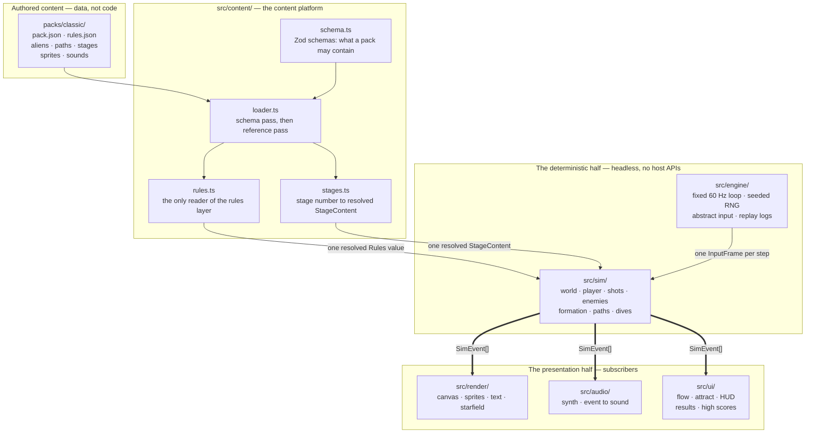
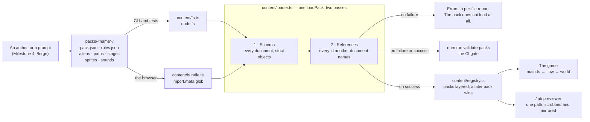
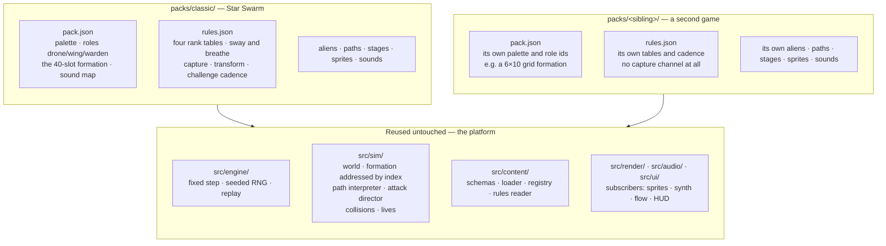

# Star Swarm — architecture

This document describes the code as it actually stands in this repository. It is
for someone who wants to run the game, see it moving, and understand the shape of
what has been built — not a contributor's guide. Where the design plan
([`docs/DESIGN.md`](DESIGN.md)) and the code disagree, this document follows the
code, and [§5](#5-what-is-not-here-yet) says where they diverge.

---

## 1. What this is

Two things at once, and the second is the reason for most of the structure.

**A 1981-arcade formation shooter.** A 224×288 portrait playfield, a fighter on a
rail along the bottom, forty aliens that fly in as scripted entry waves, take
formation, breathe in and out, and then peel off in dives to bomb you. It runs at
a fixed 60 Hz, sounds like a cabinet, and is meant to feel right to someone who
played the original.

**A content platform that happens to ship that game first.** Almost nothing about
Star Swarm is written into the program. The aliens, their sprites, their sounds,
their flight paths, the formation's geometry, the stage list, the score values,
the difficulty tables, the movement cadence and the playfield itself are JSON
documents under [`packs/classic/`](../packs/classic/). The code that runs them
holds no numbers of its own. A second game in the same arcade lineage is another
directory under `packs/`, not a fork.

That split is the whole architecture, and it is enforced rather than trusted —
see [§3](#3-the-layers).

The game is playable now: entry waves, formation motion, slot homing, dive
attacks, enemy fire, the difficulty ramp, scoring, lives, attract mode, game
over, the hit-ratio results card and the high-score table are all in, and the
normal stages through 8 are authored as pack data, and the capture mechanic —
tractor beam, captured fighter, rogue, rescue and dual fighter — is in. The
challenge stages are the Milestone 2 work still outstanding;
[§5](#5-what-is-not-here-yet) lists what that means when you play it.

---

## 2. Running it

You need Node — see the versions below — and nothing else.

```sh
npm install
npm run dev            # http://localhost:5173
```

Then press **Enter** (or **1**) to start a game, **←/→** or **A/D** to move, and
**Space** or **Z** to fire. Fire is an auto-repeat button, as it is on the
cabinet: hold it down, and a shot leaves whenever the two-shot cap frees a slot.
The game boots into _attract mode_, so nothing responds to the arrows until you
have pressed start.

### Supported Node versions

`package.json` declares `"node": "^22.13.0 || >=24.0.0"`. The floor is set by the
toolchain rather than by the game: Vitest 5 needs 22.12 or newer and ESLint 10
needs 22.13 on the 22 LTS line. CI runs Node 24; this was last verified end to
end on Node 25.9.0, where the whole check suite below passes.

### The commands

| Command                  | What it does                                                 |
| ------------------------ | ------------------------------------------------------------ |
| `npm run dev`            | Vite dev server, with the `/lab` route (see [§4.3](#43-lab)) |
| `npm run build`          | Typecheck, then build to `dist/`                             |
| `npm run preview`        | Serve the built bundle                                       |
| `npm run lint`           | ESLint and Prettier                                          |
| `npm run typecheck`      | `tsc --noEmit`                                               |
| `npm test`               | Vitest: the `unit` and `sim` suites, both headless           |
| `npm run test:e2e`       | Playwright against the dev server                            |
| `npm run validate-packs` | Schema- and reference-check everything under `packs/`        |
| `npm run sprite-sheet`   | Render a pack's art to `docs/media/classic-sprite-sheet.png` |

CI runs lint, typecheck, both test suites, pack validation, the build and the
Playwright smoke test on every push and pull request.

> **Two dev servers at once.** Vite's port is shared between checkouts and
> `playwright.config.ts` reuses an existing server outside CI, so a second
> worktree's Playwright run will silently test the first one's build. Set
> `STAR_SWARM_PORT` to give a checkout its own.

### What it looks like

Stage 1 from the first frame: five entry waves flying in on scripted paths, the
formation assembling slot by slot, the sway running out until the whole block is
exactly centred, the breathe taking over — and then the fighter opening up on it.


The front end around that is one state machine with five phases. The cabinet
boots into attract mode, where the demo behind the cards is the _real_ simulation
replaying a recorded input log; start begins a game; three fighters lost ends it
into the game-over banner, the hit-ratio results card, and back to attract.


---

## 3. The layers

Six directories under `src/`, in two groups: the half that computes what happens,
and the half that shows it. The arrows below all point one way, and that is the
single most important fact about this codebase.



`src/main.ts` is the only place those four meet and is deliberately not on the
picture: it loads the pack, owns the display, the keyboard and the audio context,
calls `flow.step(frame)` once per simulation step, hands the events that come
back to the subscribers, and draws whatever phase the flow says it is in. It
holds no game logic of its own.

Read the picture as three claims.

**`src/sim/` imports nothing from `src/render/`, `src/audio/` or `src/ui/`, and
touches no host API.** No DOM, no Canvas, no Web Audio, no `Date`, no
`performance`, no `Math.random`. It is handed an input frame and a step, and it
hands back a list of events describing what happened. The presentation layers
read those; nothing calls back in.

**That rule is mechanical.** `eslint.config.js` restricts the imports and the
host globals inside `src/sim/`, and bans `Math.random` across `src/sim/` and
`src/engine/`. `tests/unit/sim-boundary.test.ts` scans the tree as a backstop
_and_ runs ESLint against a deliberately illegal probe file, so the rules cannot
be quietly deleted. Both run in CI. (The tree scan is textual, which is why an
identifier spelled exactly `window` fails inside `src/sim/` even as a local
variable — name it `hitWindow`.)

**That is what buys the testing story.** Because the simulation needs no browser,
both Vitest projects run on the **Node** environment with no DOM at all:
`tests/sim/` runs whole games headlessly, and the golden replays in
`tests/sim/golden/` re-run a recorded seed and input log and fail if the run no
longer ends in the same state. Attract mode is the same mechanism pointed at the
screen — it is the real game replaying a real input log, so the demo cannot drift
from the game.

One honest limit on that, worth stating because it is easy to overclaim:
**determinism holds for a given machine, not across machines.** `Math.sin`,
`Math.cos` and `Math.atan2` are engine-defined and can land one unit in the last
place apart on different CPU architectures — a golden recorded on an arm64 Mac
really did fail CI on x86-64 Linux over a single bit in one enemy's position. So
the state a golden compares is quantised to six decimal places: far coarser than
that noise, and still half a million times finer than the half-pixel that is the
finest difference anyone could see. That makes the goldens portable; it does not
make the simulation bit-identical, and nothing here claims it does.

### The layers one at a time

| Layer          | What it is                                                                                                                               |
| -------------- | ---------------------------------------------------------------------------------------------------------------------------------------- |
| `src/engine/`  | The fixed-step loop, the seeded RNG, abstract input, and input recording/replay. Knows nothing about this game or any game.              |
| `src/sim/`     | The world and one step of it: player, shots, collisions, lives, enemies, formation, the path interpreter, dives, enemy fire and capture. |
| `src/content/` | The content platform: the Zod schemas, the loader, the registry, and the one module that interprets a rules document.                    |
| `src/render/`  | The 224×288 backbuffer presented at a whole-number scale, sprite rasterisation, the pixel font, the starfield, and scene composition.    |
| `src/audio/`   | A parametric synth over Web Audio, and the mapping from simulation events to sounds.                                                     |
| `src/ui/`      | The game-flow state machine, attract mode, the HUD, the results card, the high-score table — and the dev-only `/lab`.                    |

Four properties worth knowing, because each one is load-bearing:

- **Time is steps, never milliseconds.** `src/engine/loop.ts` accumulates in
  whole steps and carries a tolerance, because 1/60 is not representable in
  binary floating point and naive millisecond subtraction loses a step per burst.
  Every timer in `src/ui/flow.ts` counts simulation steps too, so a screen looks
  the same at the same step on any machine.
- **The simulation has no constants.** `createWorld` _requires_ a resolved
  `Rules` value. The movement cadence, travel limits, shot cap, hit windows,
  extra-life thresholds, the formation's sway and breathe, the enemy update
  cadence, the starfield speed formula and the playfield dimensions all arrive
  from the pack. A number the sim needs that is not in the schema is a number no
  pack can change — which is the failure this arrangement exists to prevent.
- **The renderer holds no art and no colours.** Everything derived from pack data
  is rasterised once when the pack loads, not per frame, and a sprite colour the
  pack's palette does not declare is a load-time error rather than a silent black
  pixel.
- **Audio is optional by construction.** No `AudioContext` exists until a user
  gesture unlocks one, and every call into Web Audio is wrapped, so a browser
  that blocks audio leaves the game running correctly in silence. Which event
  plays which sound is the pack's `sounds` map; `src/audio/sfx.ts` names no
  effect of its own.

---

## 4. Where a new pack, and a new game, plug in

### 4.1 The content pipeline

A pack is authored — by hand today, by a `/forge` prompt in Milestone 4 — as
plain JSON under `packs/<name>/`. Nothing else reads those files: everything goes
through one `loadPack`, and the same function serves the browser, the tests and
the validation gate, so the game and the gate cannot disagree about what a pack
contains.



Three things the picture is making explicit:

- **A pack that fails either pass never loads.** `loadPack` returns errors or a
  pack, never both, and there is no partially-loaded intermediate for a caller to
  reach for. `npm run validate-packs` calls that same function rather than
  reimplementing the checks, which is why the gate cannot pass something the game
  then refuses to boot on.
- **Two readers, deliberately.** `fs.ts` walks the directory with `node:fs` for
  the validator and the tests; `bundle.ts` walks the same tree with Vite's
  `import.meta.glob` for the browser. Neither is re-exported from the platform's
  `index.ts` — one would pull `node:fs` into the browser bundle, the other a
  Vite-only transform into plain Node — and `tests/unit/bundled-packs.test.ts`
  holds the two to each other.
- **The simulation never sees any of this.** It is handed a resolved `Rules`
  value and a `StageSource` that answers "what plays as stage _n_". It has no
  idea a pack, a registry or a file exists.

### 4.2 How far each number may be trusted

Arcade-derived packs mix numbers taken from a ROM disassembly with numbers
somebody chose, and the two are not equally free to change. So the marking is
data: `provenance` in `rules.json` maps a field path to **verified**
([`docs/reference/arcade-reference.md`](reference/arcade-reference.md) carries
the routine behind it) or **provisional** (it is ours), with a note. The loader
rejects a provenance key that names no field, so a rename cannot leave a stale
marking behind. It is granular where the confidence is: a shot window's Δx bounds
are verified and its Δy bounds are not.

### 4.3 `/lab`

`/lab` is where a human checks one piece of content in isolation before it goes
anywhere near a stage. Today it previews movement paths: every path in the loaded
packs, one drawn at a time, with a scrubber, a live readout of position, heading
and speed at the current frame, a mirror toggle, and click-to-place markers for
the formation slot and the player. Aliens, sprites, sounds and stages join it in
Milestone 4.


Two details the clip shows that matter more than they look:

- **Mirroring is a reflection applied to the evaluation, not a second copy of the
  data.** World-space targets reflect in, sampled positions reflect out, and arcs
  reverse their handedness because the reflection says so. A pack that ships a
  hand-mirrored twin of a path is working against the interpreter. The game uses
  the same mechanism to fan a dive outwards, picking the flag from which side of
  the formation the enemy sits on.
- **A dive path states no start position.** It is flown from wherever the enemy
  already sits, so every segment is relative to the flyer's pose. `/lab` starts
  such a path at its slot marker, which is why a dive previews there at all.

`/lab` is dev-only, three ways at once: Vite's only build input is `index.html`,
nothing on that graph imports the lab, and the URL is wired up by a plugin
declaring `apply: 'serve'`. `tests/unit/lab-dev-only.test.ts` checks all three.

### 4.4 Where a second game plugs in

The standing direction is that Star Swarm is the first game on a shared arcade
platform, with a Galaxian-lineage mode and further variants to follow. A sibling
game is **another pack and another `rules.json`**. Nothing under `src/` is
expected to change.



The split follows the classification in the rules-and-scoring scout report
(section 9), not a fresh decision:

**Platform — the shape any game in this lineage needs.** The score pipeline: a
base value, a multiplier that depends on the target's motion _state_, and a
separate bonus channel. The rules skeleton: reserve lives, threshold-based extra
lives with a repeat interval and a ceiling, a cap on player shots and a cap on
enemy bullets, rank as a selector over whole data tables rather than a
multiplier, and a stage-number → table lookup whose plateau rule is per-table
data. The formation geometry: _N_ column coordinates plus _M_ row coordinates,
with enemies addressing them by **index** — which is why sway and breathe move
sixteen numbers instead of forty, and why a differently shaped grid inherits both
motions with no new code. The starfield's speed byte.

**Star Swarm's own, and therefore in the pack.** The specific values and the
specific state machines: the 50/80/150 score bases, the escort-bonus latch, the
capture channel and everything hanging off it (a sibling need not have any of
it), the transform attack, the challenge cadence, the sway and breathe
amplitudes, and the entry scripts.

**The two seams that would fork the engine if hard-coded.** The report names
both, and the code keeps both on the data side:

1. **The score-group table.** The doubling _rule_ is the platform's —
   `rules.scoring.movingMultiplier`, applied by the simulation on the target's
   motion state, so an alien shot while diving or entering is worth double the
   one sitting in formation. The _values_ are the pack's: each alien declares its
   own base score, and "this one takes a second hit" is that alien's own `hp` and
   `hitSprites`, not a role the engine knows about. A sibling with different
   groups and a different two-hit rule changes only its own documents.
2. **Stage-index arithmetic.** This game alone uses several different functions
   from stage number to table row, so the platform provides "look up row
   _f_(stage) in table _T_" with _f_ declared per table: every ramp is literal
   rows plus its **own** plateau period (`plateauTableSchema` and `resolveRow` in
   `src/content/schema.ts`), and the normal and challenge stage sequences
   deliberately plateau on different periods. Nothing interpolates between rows,
   and there is no difficulty multiplier anywhere — three of the four rank tables
   contain a stage markedly easier than the one before, and a curve cannot
   reproduce that.

Concretely, a sibling supplies a manifest (its palette, its role ids, its
formation), a `rules.json`, and its own aliens, paths, stages, sprites and
sounds. It reuses the loader, the registry, the path interpreter, the formation
machinery, the attack director, the renderer, the synth, the front-end flow and
the whole test harness.

---

## 5. What is not here yet

Stated plainly, because it is visible the moment you play:

- **Challenge stages.** `stageSequence.challenge` is empty, so stages 3 and 7 —
  the challenge slots — fall back to a normal stage rather than meeting an empty
  screen. That fallback is a temporary bridge in `content/stages.ts` and is
  marked as one.
- **Stages past 8.** The pack authors the normal stages through 8 and then
  plateaus on the last of them, because the arcade's seventeen-entry index list
  cycles its final three rows and claiming that plateau three rows early would
  assert something that is not there. Difficulty keeps ramping past 8 regardless:
  the rank table is a separate ramp with its own 26 rows.
- **`render/crt.ts`, `audio/music.ts`, `ui/menus.ts`** and the validator's
  playability checks are named in the design plan and are not written yet.

Two places where the tree departs from [`docs/DESIGN.md`](DESIGN.md) section 9's
listing, both of which this document follows the code on:

- The plan lists `sim/capture.ts`, `sim/scoring.ts` and `sim/stages.ts`. Only
  `capture.ts` exists. Scoring is in `sim/enemies.ts` and `sim/world.ts`; stage
  resolution is `content/stages.ts`, on the content side of the boundary, because
  resolving a stage number to its documents is content work rather than
  simulation work.
- The plan puts `schema.ts, loader.ts, registry.ts` in `src/content/`, where
  there are now also `rules.ts`, `stages.ts`, `errors.ts`, and the two pack
  readers `fs.ts` and `bundle.ts`.

Neither is a change of plan; the plan remains the source of truth for scope and
milestones.

---

## Where to read next

| You want                           | Read                                                                  |
| ---------------------------------- | --------------------------------------------------------------------- |
| Scope, milestones, the spec        | [`docs/DESIGN.md`](DESIGN.md)                                         |
| Why an arcade number is what it is | [`docs/reference/arcade-reference.md`](reference/arcade-reference.md) |
| What a pack may contain            | `src/content/schema.ts` — the schemas are the documentation           |
| A directory's own rules            | The `README.md` in each of `src/*/`, `packs/` and `packs/classic/`    |
| How the clips were captured        | [`docs/media/README.md`](media/README.md)                             |
| The sharp edges                    | [`AGENTS.md`](../AGENTS.md)                                           |
