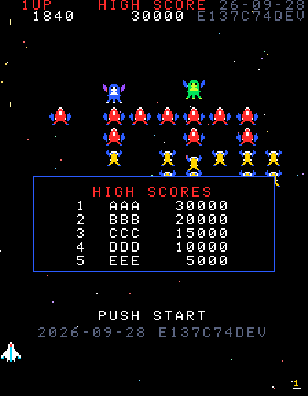
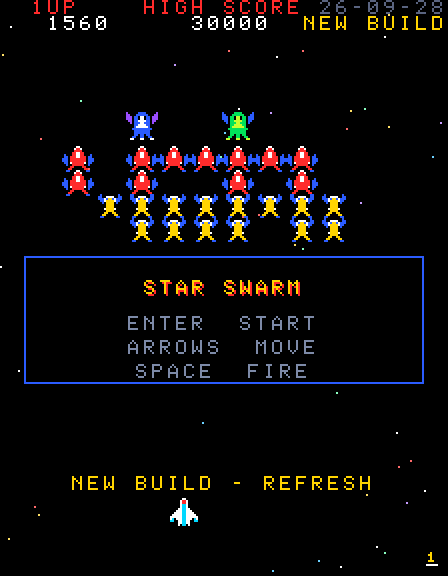
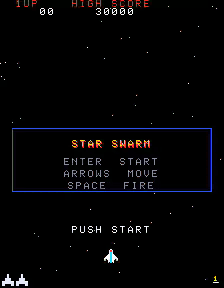
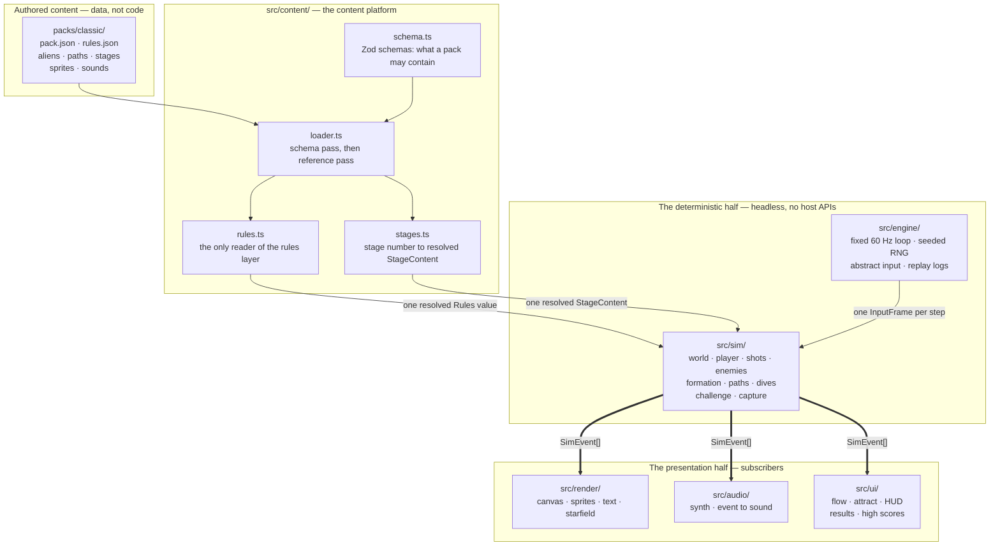
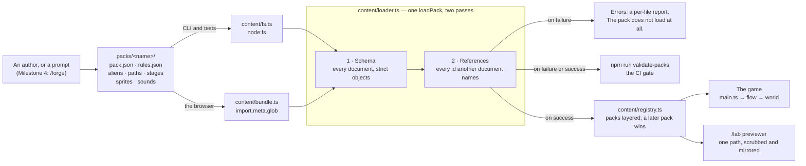
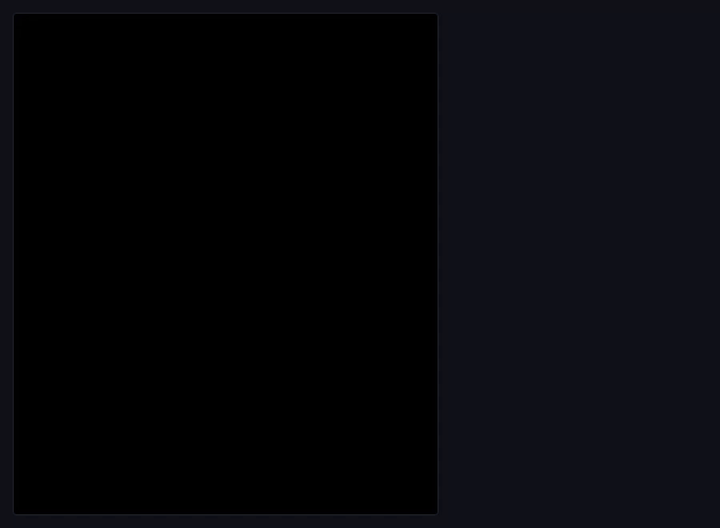
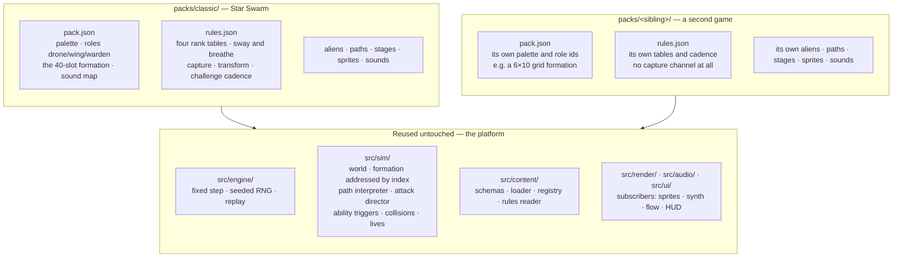

<!-- doc:layer state -->

# Star Swarm — architecture

This document describes the code as it actually stands in this repository. It is
for someone who wants to run the game, see it moving, and understand the shape of
what has been built — not a contributor's guide. Where the design plan
([`docs/DESIGN.md`](DESIGN.md)) and the code disagree, this document follows the
code, and [§5](#5-what-is-not-here-yet) says where they diverge.

> **This is the one document here that makes claims about what exists**, so it is
> the one under test. `tests/unit/docs-accuracy.test.ts` checks every path it
> names, every link and heading it points at, every command it tells you to run,
> the Node range it quotes, every count it states, and — in [§5](#5-what-is-not-here-yet) —
> that everything it calls absent really is. A change that falsifies one of those
> fails its own pull request. `AGENTS.md` has the marker vocabulary; what is not
> checked is prose about _why_, which no test can reach.
>
> Intent lives in [`docs/DESIGN.md`](DESIGN.md), what is next in
> [`docs/ROADMAP.md`](ROADMAP.md), and the unpromised in
> [`docs/IDEAS.md`](IDEAS.md). None of those describes this tree.

---

## 1. What this is

Two things at once, and the second is the reason for most of the structure.

**A 1981-arcade formation shooter.** A 224×288 portrait playfield, a fighter on a
rail along the bottom, forty aliens that fly in as five scripted entry waves,
take formation, breathe in and out, and then peel off in dives to bomb you. It
runs at a fixed 60 Hz, sounds like a cabinet, and is meant to feel right to
someone who played the original.
<!-- check:count classic.formation.slots 40 classic.entryWaves 5 -->

**A content platform that happens to ship that game first.** Almost nothing about
Star Swarm is written into the program. The aliens, their sprites, their sounds,
their flight paths, the formation's geometry, the stage list, the score values,
the difficulty tables, the movement cadence and the playfield itself are JSON
documents under [`packs/classic/`](../packs/classic/). The code that runs them
holds no numbers of its own. A second game in the same arcade lineage is another
directory under `packs/`, not a fork.

That split is the whole architecture, and it is enforced rather than trusted —
see [§3](#3-the-layers).

The game is playable now, and Milestone 2 is complete: entry waves, formation
motion, slot homing, dive attacks, enemy fire, the difficulty ramp, the transform
attack, scoring, lives, attract mode, game over, the hit-ratio results card and
the high-score table are all in; the normal stages through 8 and eight challenge
stages are authored as pack data; and the capture mechanic — tractor beam,
captured fighter, rogue, rescue and dual fighter — is in. A bomb, a tractor beam
and flying into an enemy all take a fighter, which is every way the arcade has of
doing it. [§5](#5-what-is-not-here-yet) is what is left, and none of it belongs to
Milestone 2.
<!-- check:count classic.sequence.normal 6 classic.stages.challenge 8 -->

---

## 2. Running it

You need Node — see the versions below — and nothing else.

```sh
npm install
npm run dev            # http://localhost:5173
```

Then press **Enter** (or **1**) to start a game, **←/→** or **A/D** to move, and
**Space** or **Z** to fire. Fire is an auto-repeat button, as it is on the
cabinet: hold it down, and a shot leaves whenever the two-shot cap frees a slot.
The game boots into _attract mode_, so nothing responds to the arrows until you
have pressed start.

### Supported Node versions

`package.json` declares `"node": "^22.13.0 || >=24.0.0"`. The floor is set by the
toolchain rather than by the game: Vitest 5 needs 22.12 or newer and ESLint 10
needs 22.13 on the 22 LTS line. CI runs Node 24; this was last verified end to
end on Node 25.9.0, where the whole check suite below passes.

### The commands

| Command                  | What it does                                                 |
| ------------------------ | ------------------------------------------------------------ |
| `npm run dev`            | Vite dev server, with the `/lab` route (see [§4.3](#43-lab)) |
| `npm run build`          | Typecheck, then build to `dist/`                             |
| `npm run preview`        | Serve the built bundle                                       |
| `npm run lint`           | ESLint and Prettier                                          |
| `npm run typecheck`      | `tsc --noEmit`                                               |
| `npm test`               | Vitest: the `unit` and `sim` suites, both headless           |
| `npm run test:e2e`       | Playwright against the dev server                            |
| `npm run validate-packs` | Schema- and reference-check everything under `packs/`        |
| `npm run sprite-sheet`   | Render a pack's art to `docs/media/classic-sprite-sheet.png` |

CI runs lint, typecheck, both test suites, pack validation, the build and the
Playwright smoke test on every push and pull request.

> **Two dev servers at once.** Vite's port is shared between checkouts and
> `playwright.config.ts` reuses an existing server outside CI, so a second
> worktree's Playwright run will silently test the first one's build. Set
> `STAR_SWARM_PORT` to give a checkout its own.

### Which build am I playing?

Every screen carries it, and **no part of it is written down by hand**: the short
commit the build was made from, a `+` if the working tree was modified, `DEV` if a
dev server made it rather than `npm run build`, and the date. `scripts/build-identity.ts`
derives all four from git and the clock, and the plugin in `vite.config.ts` puts
that one serialisation in two places — into the bundle, and into a static
`build.json` beside `index.html`.

It is two dim rows in the **top HUD band**, hard right of the arcade's own score
labels, and one spelled-out line under the attract screen's prompt. Nothing is
drawn over the playfield, and the corner rows fit the gaps the score leaves
exactly (`src/ui/build-stamp.ts` has the arithmetic).



**A running page notices when a newer build is being served.** It fetches
`build.json` every 60 seconds of simulation time, and when what is served is not
what it is running it blinks an amber notice in place of the commit and on the
attract line.
<!-- check:count build.pollSeconds 60 -->



The notice is text and nothing else. It never pauses the game, never takes a key,
and never moves anything already on screen — the rows it blinks in are rows it
already owned. A fetch that fails, or a host with no `build.json` to serve,
changes nothing at all: `src/ui/build-info.ts` swallows it, counts a miss, and a
detection already made is not retracted by going offline. Refreshing **does** lose
the run in progress; the high-score table survives a reload, a game does not,
which is why nothing here ever refreshes for you.

### Refresh, or restart?

Measured against the dev server rather than assumed — a page was open throughout
and each row is what it actually did:

| You changed                    | The dev server                                     | You do                                    |
| ------------------------------ | -------------------------------------------------- | ----------------------------------------- |
| anything under `src/`          | serves the new module and reloads the page for you | nothing                                   |
| a JSON document under `packs/` | the same — a pack edit reloads the page too        | nothing                                   |
| `index.html`                   | the same                                           | nothing                                   |
| `vite.config.ts`               | restarts itself, and the page reloads              | nothing                                   |
| a dependency in `package.json` | ignores it completely                              | `npm install`, then restart `npm run dev` |

So in day-to-day work there is nothing to press: the dev server reloads the page
itself, for game code and for pack data alike. Two things do not follow that rule:

- **The stamp is the moment `npm run dev` started**, not the moment you last
  edited a file, because the identity is derived when Vite reads its config.
  Restarting the dev server re-stamps it; so does touching `vite.config.ts`,
  which restarts the server anyway.
- **A new dependency needs both halves.** A running dev server goes on failing to
  resolve a package after `npm install` has put it in `node_modules`; only a
  restart picks it up.

For a **hosted** build there is no dev server and no reload: publishing is
`npm run build` and then serving `dist/`, which already contains `build.json`
alongside `index.html`. An open tab notices the new build within a minute of
simulation time and says so; nothing else has to be pushed to it. Two things the
host has to get right — `build.json` must be served uncached, or the poll reads
the old answer forever, and it must sit beside `index.html`, because the page asks
for it relative to its own document so that a deployment under a subpath works.

### What it looks like

Stage 1 from the first frame: five entry waves flying in on scripted paths, the
formation assembling slot by slot, the sway running out until the whole block is
exactly centred, the breathe taking over — and then the fighter opening up on it.


The front end around that is one state machine with six phases — attract,
playing, the between-stage challenge card, game over, results and high-score
entry. The cabinet boots into attract mode, where the demo behind the cards is
the _real_ simulation replaying a recorded input log; start begins a game; three
fighters lost ends it into the game-over banner, the hit-ratio results card, and
then either the high-score table or straight back to attract.
<!-- check:count flow.phases 6 -->


`challenge-results` is the sixth phase and the only one that returns to
`playing`: a challenge stage has ended, the next stage is already on the field,
and the world simply stops being stepped while the card is up. It is a phase
rather than a flag precisely so that "playing" never sometimes means "not
stepping the world" — `src/ui/flow.ts` says so at the top of the file.

### The two mechanics that are easiest to read about and hardest to picture

**Capture.** A captor loops out of the formation, slides down and opens its
tractor beam; the beam takes the fighter and drags it into the captor's own
captive slot; the captured fighter then dives _with_ its captor, is freed when
the captor is shot while both are attacking, and spins in to dock as a second
ship you fly alongside.


That clip is a golden replay played back through the real simulation and the real
renderer, so what it shows is the recorded run rather than a staged one.

**A challenge stage and its card.** Forty enemies in five groups of eight fly
scripted convoys and leave without ever attacking; the stage then ends on the
between-stage card, with the hit count and the end-of-stage award.



> The score this clip happens to land on is one the arcade record does not yet
> settle. `docs/reference/arcade-reference.md` section 11's open item is whether a
> challenge stage's second wave keeps four boss-class objects; the two readings
> differ by 1,200 points on a perfect first challenge stage, and the pack is built
> to one of them. `packs/classic/stages/README.md` carries both. Read the clip as
> the mechanic, not as the number.

---

## 3. The layers

Six directories under `src/`, in two groups: the half that computes what happens,
and the half that shows it. The arrows below all point one way, and that is the
single most important fact about this codebase.
<!-- check:count src.layers 6 -->



`src/main.ts` is the only place those four meet and is deliberately not on the
picture: it loads the pack, owns the display, the keyboard and the audio context,
calls `flow.step(frame)` once per simulation step, hands the events that come
back to the subscribers, and draws whatever phase the flow says it is in. It
holds no game logic of its own.

Read the picture as three claims.

**`src/sim/` imports nothing from `src/render/`, `src/audio/` or `src/ui/`, and
touches no host API.** No DOM, no Canvas, no Web Audio, no `Date`, no
`performance`, no `Math.random`. It is handed an input frame and a step, and it
hands back a list of events describing what happened. The presentation layers
read those; nothing calls back in.

**That rule is mechanical.** `eslint.config.js` restricts the imports and the
host globals inside `src/sim/`, and bans `Math.random` across `src/sim/` and
`src/engine/`. `tests/unit/sim-boundary.test.ts` scans the tree as a backstop
_and_ runs ESLint against a deliberately illegal probe file, so the rules cannot
be quietly deleted. Both run in CI. (The tree scan is textual, which is why an
identifier spelled exactly `window` fails inside `src/sim/` even as a local
variable — name it `hitWindow`.)

**That is what buys the testing story.** Because the simulation needs no browser,
both Vitest projects run on the **Node** environment with no DOM at all:
`tests/sim/` runs whole games headlessly, and the golden replays in
`tests/sim/golden/` re-run a recorded seed and input log and fail if the run no
longer ends in the same state. Attract mode is the same mechanism pointed at the
screen — it is the real game replaying a real input log, so the demo cannot drift
from the game.
<!-- check:count vitest.projects 2 -->

One honest limit on that, worth stating because it is easy to overclaim:
**determinism holds for a given machine, not across machines.** `Math.sin`,
`Math.cos` and `Math.atan2` are engine-defined and can land one unit in the last
place apart on different CPU architectures — a golden recorded on an arm64 Mac
really did fail CI on x86-64 Linux over a single bit in one enemy's position. So
the state a golden compares is quantised to six decimal places: far coarser than
that noise, and still half a million times finer than the half-pixel that is the
finest difference anyone could see. That makes the goldens portable; it does not
make the simulation bit-identical, and nothing here claims it does.

### The layers one at a time

| Layer          | What it is                                                                                                                                                 |
| -------------- | ---------------------------------------------------------------------------------------------------------------------------------------------------------- |
| `src/engine/`  | The fixed-step loop, the seeded RNG, abstract input, and input recording/replay. Knows nothing about this game or any game.                                |
| `src/sim/`     | The world and one step of it: player, shots, collisions, lives, enemies, formation, the path interpreter, dives, enemy fire, challenge stages and capture. |
| `src/content/` | The content platform: the Zod schemas, the loader, the registry, the module that interprets a rules document, and stage resolution.                        |
| `src/render/`  | The 224×288 backbuffer presented at a whole-number scale, sprite rasterisation, the pixel font, the starfield, and scene composition.                      |
| `src/audio/`   | A parametric synth over Web Audio, and the mapping from simulation events to sounds.                                                                       |
| `src/ui/`      | The game-flow state machine, attract mode, the HUD, the results card, the high-score table — and the dev-only `/lab`.                                      |

Four properties worth knowing, because each one is load-bearing:

- **Time is steps, never milliseconds.** `src/engine/loop.ts` accumulates in
  whole steps and carries a tolerance, because 1/60 is not representable in
  binary floating point and naive millisecond subtraction loses a step per burst.
  Every timer in `src/ui/flow.ts` counts simulation steps too, so a screen looks
  the same at the same step on any machine.
- **The simulation has no constants.** `createWorld` _requires_ a resolved
  `Rules` value. The movement cadence, travel limits, shot cap, hit windows,
  extra-life thresholds, the formation's sway and breathe, the enemy update
  cadence, the starfield speed formula and the playfield dimensions all arrive
  from the pack. A number the sim needs that is not in the schema is a number no
  pack can change — which is the failure this arrangement exists to prevent.
- **The renderer holds no art and no colours.** Everything derived from pack data
  is rasterised once when the pack loads, not per frame, and a sprite colour the
  pack's palette does not declare is a load-time error rather than a silent black
  pixel.
- **Audio is optional by construction.** No `AudioContext` exists until a user
  gesture unlocks one, and every call into Web Audio is wrapped, so a browser
  that blocks audio leaves the game running correctly in silence. Which event
  plays which sound is the pack's `sounds` map; `src/audio/sfx.ts` names no
  effect of its own.

---

## 4. Where a new pack, and a new game, plug in

### 4.1 The content pipeline

A pack is authored — by hand today, by a `/forge` prompt in Milestone 4 — as
plain JSON under `packs/<name>/`. Nothing else reads those files: everything goes
through one `loadPack`, and the same function serves the browser, the tests and
the validation gate, so the game and the gate cannot disagree about what a pack
contains.



Three things the picture is making explicit:

- **A pack that fails either pass never loads.** `loadPack` returns errors or a
  pack, never both, and there is no partially-loaded intermediate for a caller to
  reach for. `npm run validate-packs` calls that same function rather than
  reimplementing the checks, which is why the gate cannot pass something the game
  then refuses to boot on.
- **Two readers, deliberately.** `fs.ts` walks the directory with `node:fs` for
  the validator and the tests; `bundle.ts` walks the same tree with Vite's
  `import.meta.glob` for the browser. Neither is re-exported from the platform's
  `index.ts` — one would pull `node:fs` into the browser bundle, the other a
  Vite-only transform into plain Node — and `tests/unit/bundled-packs.test.ts`
  holds the two to each other.
- **The simulation never sees any of this.** It is handed a resolved `Rules`
  value and a `StageSource` that answers "what plays as stage _n_". It has no
  idea a pack, a registry or a file exists.

### 4.2 How far each number may be trusted

Arcade-derived packs mix numbers taken from a ROM disassembly with numbers
somebody chose, and the two are not equally free to change. So the marking is
data: `provenance` in `rules.json` maps a field path to **verified**
([`docs/reference/arcade-reference.md`](reference/arcade-reference.md) carries
the routine behind it) or **provisional** (it is ours), with a note. The loader
rejects a provenance key that names no field, so a rename cannot leave a stale
marking behind. It is granular where the confidence is: a shot window's Δx bounds
are verified and its Δy bounds are not.

### 4.3 `/lab`

`/lab` is where a human checks one piece of content in isolation before it goes
anywhere near a stage. Today it previews movement paths: every path in the loaded
packs, one drawn at a time, with a scrubber, a live readout of position, heading
and speed at the current frame, a mirror toggle, and click-to-place markers for
the formation slot and the player. Aliens, sprites, sounds and stages join it in
Milestone 4.



Two details the clip shows that matter more than they look:

- **Mirroring is a reflection applied to the evaluation, not a second copy of the
  data.** World-space targets reflect in, sampled positions reflect out, and arcs
  reverse their handedness because the reflection says so. A pack that ships a
  hand-mirrored twin of a path is working against the interpreter. The game uses
  the same mechanism to fan a dive outwards, picking the flag from which side of
  the formation the enemy sits on.
- **A dive path states no start position.** It is flown from wherever the enemy
  already sits, so every segment is relative to the flyer's pose. `/lab` starts
  such a path at its slot marker, which is why a dive previews there at all.

`/lab` is dev-only, three ways at once: Vite's only build input is `index.html`,
nothing on that graph imports the lab, and the URL is wired up by a plugin
declaring `apply: 'serve'`. `tests/unit/lab-dev-only.test.ts` checks all three.

### 4.4 Where a second game plugs in

The standing direction is that Star Swarm is the first game on a shared arcade
platform, with a Galaxian-lineage mode and further variants to follow. A sibling
game is **another pack and another `rules.json`**. Nothing under `src/` is
expected to change.



The clearest single example of that boundary is the tractor beam, because it is
already built both sides of the line. `packs/classic/paths/dive-capture.json` is
four segments of authored data, and the third of them is:

```json
{ "type": "trigger", "ability": "captureBeam" }
```

The path says _when_ — a `trigger` segment on the flight's timeline, after the
loop and the run at the player. `src/sim/capture.ts` is _what_, and it opens the
beam when a flight passes that segment naming that ability. Neither knows the
other: the path names an id from the fixed registry in `src/content/schema.ts`,
and the channel matches on the id. So moving the beam later in the dive is a
one-line edit to a pack document, and a sibling game that wants a beam of its own
authors the same `trigger` in its own path — while a sibling that wants none
simply never writes one, which is why "no capture channel at all" is a property
of a pack rather than a branch in the engine.

The split follows the classification in the rules-and-scoring scout report
(section 9), not a fresh decision:

**Platform — the shape any game in this lineage needs.** The score pipeline: a
base value, a multiplier that depends on the target's motion _state_, and a
separate bonus channel. The rules skeleton: reserve lives, threshold-based extra
lives with a repeat interval and a ceiling, a cap on player shots and a cap on
enemy bullets, rank as a selector over whole data tables rather than a
multiplier, and a stage-number → table lookup whose plateau rule is per-table
data. The formation geometry: _N_ column coordinates plus _M_ row coordinates,
with enemies addressing them by **index** — which is why sway and breathe move
sixteen numbers instead of forty, and why a differently shaped grid inherits both
motions with no new code. The starfield's speed byte.

**Star Swarm's own, and therefore in the pack.** The specific values and the
specific state machines: the 50/80/150 score bases, the escort-bonus latch, the
capture channel and everything hanging off it (a sibling need not have any of
it), the transform attack, the challenge cadence, the sway and breathe
amplitudes, and the entry scripts.

**The two seams that would fork the engine if hard-coded.** The report names
both, and the code keeps both on the data side:

1. **The score-group table.** The doubling _rule_ is the platform's —
   `rules.scoring.movingMultiplier`, applied by the simulation on the target's
   motion state, so an alien shot while diving or entering is worth double the
   one sitting in formation. The _values_ are the pack's: each alien declares its
   own base score, and "this one takes a second hit" is that alien's own `hp` and
   `hitSprites`, not a role the engine knows about. A sibling with different
   groups and a different two-hit rule changes only its own documents.
2. **Stage-index arithmetic.** This game alone uses several different functions
   from stage number to table row, so the platform provides "look up row
   _f_(stage) in table _T_" with _f_ declared per table: every ramp is literal
   rows plus its **own** plateau period (`plateauTableSchema` and `resolveRow` in
   `src/content/schema.ts`), and the normal and challenge stage sequences
   deliberately plateau on different periods. Nothing interpolates between rows,
   and there is no difficulty multiplier anywhere — three of the four rank tables
   contain a stage markedly easier than the one before, and a curve cannot
   reproduce that.

Concretely, a sibling supplies a manifest (its palette, its role ids, its
formation), a `rules.json`, and its own aliens, paths, stages, sprites and
sounds. It reuses the loader, the registry, the path interpreter, the formation
machinery, the attack director, the renderer, the synth, the front-end flow and
the whole test harness.

---

## 5. What is not here yet

Milestone 2 is complete, so nothing below is missing from the game you can play
today — it is the content the pack does not yet author, and the modules the plan
calls for that nobody has written. **Every absence here is checked**: the marker
at the end of each item fails the build on the day the file lands, because a
stale absence list is the failure mode this section is most prone to — a document
describing as deliberately absent something that shipped two merges ago.
[`docs/ROADMAP.md`](ROADMAP.md) is where each of these is scheduled.

- **Normal stages past 8.** The pack authors the normal stages through 8 and then
  plateaus on the last of them, because the arcade's seventeen-entry index list
  cycles its final three rows and claiming that plateau three rows early would
  assert something that is not there. The challenge half does _not_ plateau — all
  eight of its scripts cycle — so the two halves of one sequence deliberately
  repeat on different periods. Difficulty keeps ramping past 8 either way: the
  rank table is a separate ramp with its own 26 rows across all four ranks.
  <!-- check:count classic.sequence.normal 6 classic.sequence.challenge 8 rules.ranks 4 rules.difficultyRows 26 -->
- **The other three difficulty ranks' stage sequences.** The pack ships one
  pack-wide sequence. Reference section 5 gives all four ranks' index lists, and
  they need ten of the thirteen combat scripts through stage 8 alone;
  `packs/classic/stages/README.md` records why they cannot land until the
  remaining scripts do.
- **The ability registry.** `src/sim/abilities/` is a placeholder README and holds
  no code. The one ability the game needs is implemented directly in
  `src/sim/capture.ts`, which matches on the `captureBeam` id a path's `trigger`
  segment names ([§4.4](#44-where-a-second-game-plugs-in)); splitting the registry
  out, and the six other ids `src/content/schema.ts` already reserves, is
  Milestone 3.
  <!-- check:count sim.abilities.modules 0 schema.abilityIds 7 -->
- **The optional CRT filter, music, the settings menu** and the validator's
  playability checks are named in the design plan and are not written yet.
  <!-- check:absent src/render/crt.ts src/audio/music.ts src/ui/menus.ts -->
- **No stage is a boss stage.** `boss` is one of the three stage kinds the schema
  admits, and no pack document uses it — what a boss stage would be has never
  been specified ([`docs/IDEAS.md`](IDEAS.md)).
  <!-- check:count classic.stages.boss 0 schema.stageKinds 3 -->
- **A captor never launches with escorts, so 800 and 1,600 are unreachable.** The
  escort bonus itself is paid: a captor carries the latched value its stage start
  installs and `enemyScore` in `src/sim/enemies.ts` adds it on the doubled branch,
  so a captor destroyed mid-dive is worth 400 and one shot at home is worth 150.
  What is missing is the _launch_: `src/sim/dive.ts` sends one enemy of a role down
  per round robin and has no notion of a boss leading a wingman, so the pack's
  `scoring.escortBonus.byEscortCount` entries for one and two escorts are data
  nothing can select. The scout report's acceptance tests **S7 and S9** are
  therefore not satisfiable today, and the latch that makes them interesting —
  killing the escorts first must not reduce the captor's value — cannot be
  observed either.
- **The starfield scrolls at its own rate, not the reference's.** The per-stage
  _speed byte_ is the pack's verified formula and the simulation reports it
  (`starfieldSpeedByte`, `stage-started`), but the byte-to-pixels conversion in
  `src/render/starfield.ts` is `SPEED_TIERS`, which is ours and is half the
  reference's closed value of `byte / 64` — 0.5 to 1.5 px/frame against 1.00 to
  2.00. Three behaviours in the same routine are also absent: the one-unit-per-frame
  ramp between stages, the 3 px/frame reverse while a tractor beam is pulling the
  ship in, and the star-bank twinkle. Acceptance tests **M6, M7 and M8**. Closing
  them doubles the visible scroll rate, which is a change to how the game feels
  rather than a defect, so it is the captain's call and not a quiet fix.
- **There is no pulsing-formation sound.** `formation-settled` is raised on the
  frame the sway passes back through zero and the breathe begins there, which is
  asserted in `tests/unit/formation.test.ts`; the arcade starts its pulsing
  formation tune on that same frame, and `packs/classic/pack.json` binds no sound
  to the event. The second half of acceptance test **M2** is therefore about
  something the pack does not ship yet.

Two arcade questions are also still open rather than decided, and the game is
built to one reading of each. Both are written down in
`docs/reference/arcade-reference.md` section 11, and both are recorded here
rather than resolved because nothing in `src/` turns on the answer, as they are
in [`docs/ROADMAP.md`](ROADMAP.md#open-questions-this-roadmap-does-not-answer):

- **Whether a challenge stage's second wave keeps four boss-class objects.** It
  changes what a perfect challenge stage pays; the alternative readings are also
  in `packs/classic/stages/README.md`, and switching is one line per challenge
  document.
- **What a collision with an enemy body does beyond killing the fighter** —
  whether it destroys the enemy as well, and whether it scores. Every kill and
  every point the reference traces arrives through the original's _rocket_ hit
  dispatcher and none through the fighter-hit path, so the engine takes the
  negative reading of both: a ram costs a fighter and changes nothing else.
  Switching would be `resolveBodyCollisions` in `src/sim/world.ts` and the
  goldens it moves.

<!-- check:count reference.openQuestions 2 -->

### Two places where the tree departs from the plan

[`docs/DESIGN.md`](DESIGN.md#9-architecture-split-so-crewmates-dont-collide)
section 9 fixes the six directories under `src/` and what belongs in each; it
names no modules, deliberately, and this document is the listing. Two of its
divisions of labour did not survive contact with the code, and the code is what
this document follows:

- **There is no scoring module and no stage module in the simulation.** Scoring
  lives in `src/sim/enemies.ts` and `src/sim/world.ts`, because a score is a
  property of the thing destroyed and the run it happened in rather than a stage
  in a pipeline. Stage resolution is `src/content/stages.ts`, on the content side
  of the boundary, because turning a stage number into documents is content work:
  the simulation is handed a resolved `StageContent` and never learns a pack
  exists.
  <!-- check:absent src/sim/scoring.ts src/sim/stages.ts -->
- **`src/content/` grew past the three modules the plan sketched.** Alongside
  `schema.ts`, `loader.ts` and `registry.ts` there are `rules.ts`, `stages.ts`,
  `errors.ts`, and the two pack readers `fs.ts` and `bundle.ts` — one for Node,
  one for the browser, held to each other by a test
  ([§4.1](#41-the-content-pipeline)).

Neither is a change of plan; the plan remains the source of truth for scope and
milestones.

---

## Where to read next

| You want                             | Read                                                                  |
| ------------------------------------ | --------------------------------------------------------------------- |
| Why the project exists, and the spec | [`docs/DESIGN.md`](DESIGN.md) — intent, never state                   |
| What is next, and in what order      | [`docs/ROADMAP.md`](ROADMAP.md)                                       |
| Directions nobody has committed to   | [`docs/IDEAS.md`](IDEAS.md)                                           |
| Why an arcade number is what it is   | [`docs/reference/arcade-reference.md`](reference/arcade-reference.md) |
| What a pack may contain              | `src/content/schema.ts` — the schemas are the documentation           |
| A directory's own rules              | The `README.md` in each of `src/*/`, `packs/` and `packs/classic/`    |
| How the clips were captured          | [`docs/media/README.md`](media/README.md)                             |
| The sharp edges, and the doc rules   | [`AGENTS.md`](../AGENTS.md)                                           |
