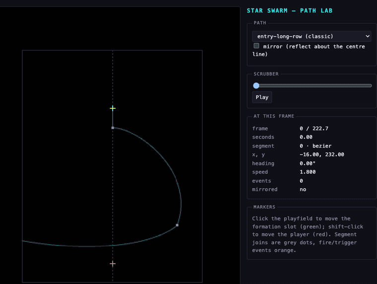

# `src/ui/lab/`

The `/lab` preview harness: pick any path, alien, sprite, sound or stage and see
or hear it in isolation, with a scrubber and a mirror toggle
(`docs/DESIGN.md` section 8 step 3).

Milestone 1 lands the **path previewer**; aliens, sprites, sounds and stages
join it in Milestone 4.

- `main.ts` — the DOM wiring, and the only file `lab.html` loads.
- `path-preview.ts` — drawing one path onto the 224×288 backbuffer.
- `packs.ts` — loads `packs/` through the same `loadPack` the game uses.

Click the canvas to move the `toSlot` marker, shift-click to move the
`aimAtPlayer` one. The slot marker is also **where a path that states no `start`
begins**, which is every dive path: a dive is flown from wherever the enemy
already sits, so moving the marker previews the same dive from a different
formation slot — including the outermost column, which is the case whose sweep
has to stay on screen.

## Dev build only

`lab.html` at the repository root is the entry document, and Vite is never told
to build it — its only input is `index.html`, and nothing on that graph imports
this directory — so none of this reaches a production bundle or the game's code
path. `vite.config.ts` maps the `/lab` URL onto `lab.html` from a plugin
declaring `apply: 'serve'`. `tests/unit/lab-dev-only.test.ts` checks all of it.

Run it with `npm run dev` and open <http://localhost:5173/lab>.

`docs/media/path-lab.gif` is `entry-long-row` scrubbed end to end, then the same
data flown again with the mirror toggle on.
